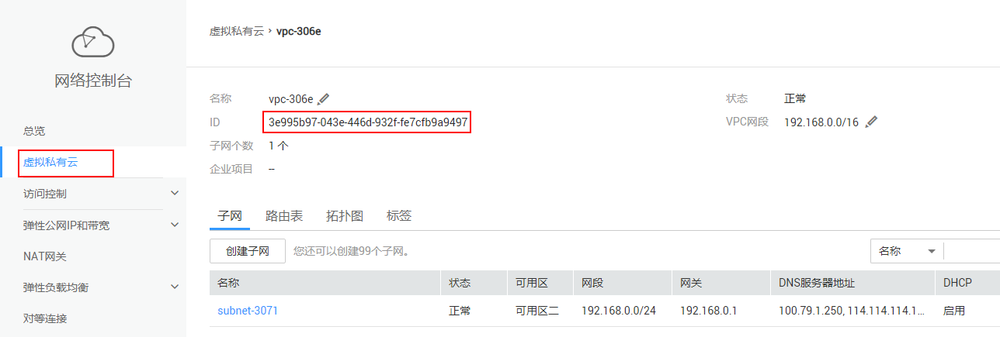
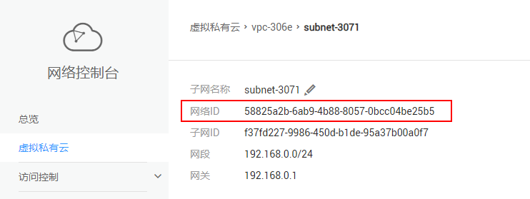
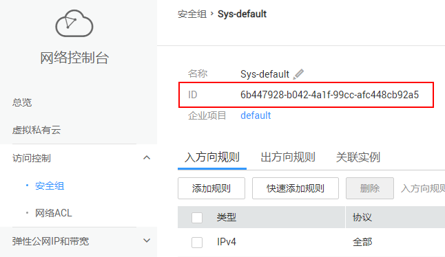

# 创建Kafka实例<a name="ZH-CN_TOPIC_0171829499"></a>

## 功能介绍<a name="zh-cn_topic_0128036927_section19327142112288"></a>

创建实例，该接口创建的实例为**按需计费**的方式。

在进行接口调用之前，请先完成以下工作：

1.  在进行接口调用之前，请先仔细阅读[如何调用API](如何调用API.md)和[快速入门](快速入门.md)章节中的内容，了解接口调用流程和操作。
2.  实例运行于虚拟私有云（VPC）中，创建前，当前租户需要先创建VPC、安全组和子网，并获取对应的VPC ID、安全组ID和子网ID。

    创建方法，可使用VPC的接口或在控制台创建。如果已有VPC，可重复使用，不需要多次创建。

    使用VPC接口创建和查看方法，请参考[《虚拟私有云API参考》](https://support.huaweicloud.com/api-vpc/zh-cn_topic_0020090608.html)。

    在控制台获取VPC ID、安全组ID和子网ID的方法如下：

    -   获取VPC ID（即vpc\_id参数）

        **图 1**  在控制台获取VPC ID<a name="fig58171311184512"></a>  
        

    -   获取子网ID（即subnet\_id参数）

        在创建Kafka实例时，需要用到的是VPC子网的网络ID，而不是下图中显示的子网ID。

        **图 2**  获取子网的网络ID<a name="fig13764103118489"></a>  
        

    -   获取安全组ID（即security\_group\_id参数）

        **图 3**  获取安全组ID<a name="fig1543656204815"></a>  
        

3.  参考本手册的[查询可用区信息](查询可用区信息.md)章节，提前获取租户创建的实例的可用区ID，确认可用区是否有资源。
4.  参考本手册的[查询产品规格列表](查询产品规格列表.md)章节，提前获取租户要订购的产品ID。

## URI<a name="zh-cn_topic_0128036927_section01615217250"></a>

POST /v1.0/\{project\_id\}/instances

参数说明见[表1](#zh-cn_topic_0128036927_table0211262515)。

**表 1**  参数说明

<a name="zh-cn_topic_0128036927_table0211262515"></a>
<table><thead align="left"><tr id="zh-cn_topic_0128036927_row2031516262518"><th class="cellrowborder" valign="top" width="16%" id="mcps1.2.5.1.1"><p id="zh-cn_topic_0128036927_p631522182516"><a name="zh-cn_topic_0128036927_p631522182516"></a><a name="zh-cn_topic_0128036927_p631522182516"></a>参数</p>
</th>
<th class="cellrowborder" valign="top" width="13%" id="mcps1.2.5.1.2"><p id="zh-cn_topic_0128036927_p731516272513"><a name="zh-cn_topic_0128036927_p731516272513"></a><a name="zh-cn_topic_0128036927_p731516272513"></a>类型</p>
</th>
<th class="cellrowborder" valign="top" width="12%" id="mcps1.2.5.1.3"><p id="zh-cn_topic_0128036927_p15315124252"><a name="zh-cn_topic_0128036927_p15315124252"></a><a name="zh-cn_topic_0128036927_p15315124252"></a>必选</p>
</th>
<th class="cellrowborder" valign="top" width="59%" id="mcps1.2.5.1.4"><p id="zh-cn_topic_0128036927_p183155252514"><a name="zh-cn_topic_0128036927_p183155252514"></a><a name="zh-cn_topic_0128036927_p183155252514"></a>说明</p>
</th>
</tr>
</thead>
<tbody><tr id="zh-cn_topic_0128036927_row183151820257"><td class="cellrowborder" valign="top" width="16%" headers="mcps1.2.5.1.1 "><p id="zh-cn_topic_0128036927_p731542202515"><a name="zh-cn_topic_0128036927_p731542202515"></a><a name="zh-cn_topic_0128036927_p731542202515"></a>project_id</p>
</td>
<td class="cellrowborder" valign="top" width="13%" headers="mcps1.2.5.1.2 "><p id="zh-cn_topic_0128036927_p14315028257"><a name="zh-cn_topic_0128036927_p14315028257"></a><a name="zh-cn_topic_0128036927_p14315028257"></a>String</p>
</td>
<td class="cellrowborder" valign="top" width="12%" headers="mcps1.2.5.1.3 "><p id="zh-cn_topic_0128036927_p43151224252"><a name="zh-cn_topic_0128036927_p43151224252"></a><a name="zh-cn_topic_0128036927_p43151224252"></a>是</p>
</td>
<td class="cellrowborder" valign="top" width="59%" headers="mcps1.2.5.1.4 "><p id="zh-cn_topic_0128036927_p10316627259"><a name="zh-cn_topic_0128036927_p10316627259"></a><a name="zh-cn_topic_0128036927_p10316627259"></a>项目ID。</p>
</td>
</tr>
</tbody>
</table>

## 请求消息<a name="zh-cn_topic_0128036927_section19344222516"></a>

**请求参数**

参数说明见[表2](#zh-cn_topic_0128036927_table63510212250)。

**表 2**  参数说明

<a name="zh-cn_topic_0128036927_table63510212250"></a>
<table><thead align="left"><tr id="zh-cn_topic_0128036927_row173161423257"><th class="cellrowborder" valign="top" width="17.171717171717173%" id="mcps1.2.5.1.1"><p id="zh-cn_topic_0128036927_p183163211252"><a name="zh-cn_topic_0128036927_p183163211252"></a><a name="zh-cn_topic_0128036927_p183163211252"></a>参数</p>
</th>
<th class="cellrowborder" valign="top" width="12.272727272727273%" id="mcps1.2.5.1.2"><p id="zh-cn_topic_0128036927_p193161422257"><a name="zh-cn_topic_0128036927_p193161422257"></a><a name="zh-cn_topic_0128036927_p193161422257"></a>类型</p>
</th>
<th class="cellrowborder" valign="top" width="11.969696969696969%" id="mcps1.2.5.1.3"><p id="zh-cn_topic_0128036927_p831610215252"><a name="zh-cn_topic_0128036927_p831610215252"></a><a name="zh-cn_topic_0128036927_p831610215252"></a>是否必选</p>
</th>
<th class="cellrowborder" valign="top" width="58.58585858585859%" id="mcps1.2.5.1.4"><p id="zh-cn_topic_0128036927_p10316142162517"><a name="zh-cn_topic_0128036927_p10316142162517"></a><a name="zh-cn_topic_0128036927_p10316142162517"></a>说明</p>
</th>
</tr>
</thead>
<tbody><tr id="zh-cn_topic_0128036927_row18316132152511"><td class="cellrowborder" valign="top" width="17.171717171717173%" headers="mcps1.2.5.1.1 "><p id="zh-cn_topic_0128036927_p1731618219251"><a name="zh-cn_topic_0128036927_p1731618219251"></a><a name="zh-cn_topic_0128036927_p1731618219251"></a>name</p>
</td>
<td class="cellrowborder" valign="top" width="12.272727272727273%" headers="mcps1.2.5.1.2 "><p id="zh-cn_topic_0128036927_p1431612210251"><a name="zh-cn_topic_0128036927_p1431612210251"></a><a name="zh-cn_topic_0128036927_p1431612210251"></a>String</p>
</td>
<td class="cellrowborder" valign="top" width="11.969696969696969%" headers="mcps1.2.5.1.3 "><p id="zh-cn_topic_0128036927_p183161727253"><a name="zh-cn_topic_0128036927_p183161727253"></a><a name="zh-cn_topic_0128036927_p183161727253"></a>是</p>
</td>
<td class="cellrowborder" valign="top" width="58.58585858585859%" headers="mcps1.2.5.1.4 "><p id="zh-cn_topic_0128036927_p14316162182511"><a name="zh-cn_topic_0128036927_p14316162182511"></a><a name="zh-cn_topic_0128036927_p14316162182511"></a>实例名称。</p>
<p id="zh-cn_topic_0128036927_p53166212252"><a name="zh-cn_topic_0128036927_p53166212252"></a><a name="zh-cn_topic_0128036927_p53166212252"></a>由英文字符开头，只能由英文字母、数字、中划线组成，长度为4~64的字符。</p>
</td>
</tr>
<tr id="zh-cn_topic_0128036927_row831615212510"><td class="cellrowborder" valign="top" width="17.171717171717173%" headers="mcps1.2.5.1.1 "><p id="zh-cn_topic_0128036927_p1031652112514"><a name="zh-cn_topic_0128036927_p1031652112514"></a><a name="zh-cn_topic_0128036927_p1031652112514"></a>description</p>
</td>
<td class="cellrowborder" valign="top" width="12.272727272727273%" headers="mcps1.2.5.1.2 "><p id="zh-cn_topic_0128036927_p931622192514"><a name="zh-cn_topic_0128036927_p931622192514"></a><a name="zh-cn_topic_0128036927_p931622192514"></a>String</p>
</td>
<td class="cellrowborder" valign="top" width="11.969696969696969%" headers="mcps1.2.5.1.3 "><p id="zh-cn_topic_0128036927_p163164282520"><a name="zh-cn_topic_0128036927_p163164282520"></a><a name="zh-cn_topic_0128036927_p163164282520"></a>否</p>
</td>
<td class="cellrowborder" valign="top" width="58.58585858585859%" headers="mcps1.2.5.1.4 "><p id="zh-cn_topic_0128036927_p63161242514"><a name="zh-cn_topic_0128036927_p63161242514"></a><a name="zh-cn_topic_0128036927_p63161242514"></a>实例的描述信息。</p>
<p id="zh-cn_topic_0128036927_p5316142122513"><a name="zh-cn_topic_0128036927_p5316142122513"></a><a name="zh-cn_topic_0128036927_p5316142122513"></a>长度不超过1024的字符串。</p>
<div class="note" id="zh-cn_topic_0128036927_note4439215254"><a name="zh-cn_topic_0128036927_note4439215254"></a><a name="zh-cn_topic_0128036927_note4439215254"></a><span class="notetitle"> 说明： </span><div class="notebody"><p id="zh-cn_topic_0128036927_p931610214253"><a name="zh-cn_topic_0128036927_p931610214253"></a><a name="zh-cn_topic_0128036927_p931610214253"></a>\与"在json报文中属于特殊字符，如果参数值中需要显示\或者"字符，请在字符前增加转义字符\，比如<strong id="zh-cn_topic_0128036927_b133161725250"><a name="zh-cn_topic_0128036927_b133161725250"></a><a name="zh-cn_topic_0128036927_b133161725250"></a>\\</strong>或者<strong id="zh-cn_topic_0128036927_b1231617292519"><a name="zh-cn_topic_0128036927_b1231617292519"></a><a name="zh-cn_topic_0128036927_b1231617292519"></a>\"</strong>。</p>
</div></div>
</td>
</tr>
<tr id="zh-cn_topic_0128036927_row731618292515"><td class="cellrowborder" valign="top" width="17.171717171717173%" headers="mcps1.2.5.1.1 "><p id="zh-cn_topic_0128036927_p931813219255"><a name="zh-cn_topic_0128036927_p931813219255"></a><a name="zh-cn_topic_0128036927_p931813219255"></a>engine</p>
</td>
<td class="cellrowborder" valign="top" width="12.272727272727273%" headers="mcps1.2.5.1.2 "><p id="zh-cn_topic_0128036927_p231862182512"><a name="zh-cn_topic_0128036927_p231862182512"></a><a name="zh-cn_topic_0128036927_p231862182512"></a>String</p>
</td>
<td class="cellrowborder" valign="top" width="11.969696969696969%" headers="mcps1.2.5.1.3 "><p id="zh-cn_topic_0128036927_p113188214252"><a name="zh-cn_topic_0128036927_p113188214252"></a><a name="zh-cn_topic_0128036927_p113188214252"></a>是</p>
</td>
<td class="cellrowborder" valign="top" width="58.58585858585859%" headers="mcps1.2.5.1.4 "><p id="zh-cn_topic_0128036927_p113181222515"><a name="zh-cn_topic_0128036927_p113181222515"></a><a name="zh-cn_topic_0128036927_p113181222515"></a>消息引擎。取值填写为：kafka。</p>
</td>
</tr>
<tr id="zh-cn_topic_0128036927_row173189212518"><td class="cellrowborder" valign="top" width="17.171717171717173%" headers="mcps1.2.5.1.1 "><p id="zh-cn_topic_0128036927_p17318152162516"><a name="zh-cn_topic_0128036927_p17318152162516"></a><a name="zh-cn_topic_0128036927_p17318152162516"></a>engine_version</p>
</td>
<td class="cellrowborder" valign="top" width="12.272727272727273%" headers="mcps1.2.5.1.2 "><p id="zh-cn_topic_0128036927_p53181326257"><a name="zh-cn_topic_0128036927_p53181326257"></a><a name="zh-cn_topic_0128036927_p53181326257"></a>String</p>
</td>
<td class="cellrowborder" valign="top" width="11.969696969696969%" headers="mcps1.2.5.1.3 "><p id="zh-cn_topic_0128036927_p631815214256"><a name="zh-cn_topic_0128036927_p631815214256"></a><a name="zh-cn_topic_0128036927_p631815214256"></a>是</p>
</td>
<td class="cellrowborder" valign="top" width="58.58585858585859%" headers="mcps1.2.5.1.4 "><p id="zh-cn_topic_0128036927_p1531819212254"><a name="zh-cn_topic_0128036927_p1531819212254"></a><a name="zh-cn_topic_0128036927_p1531819212254"></a>消息引擎的版本。取值填写为：1.1.0。</p>
</td>
</tr>
<tr id="zh-cn_topic_0128036927_row031813220253"><td class="cellrowborder" valign="top" width="17.171717171717173%" headers="mcps1.2.5.1.1 "><p id="zh-cn_topic_0128036927_p1831842142511"><a name="zh-cn_topic_0128036927_p1831842142511"></a><a name="zh-cn_topic_0128036927_p1831842142511"></a>specification</p>
</td>
<td class="cellrowborder" valign="top" width="12.272727272727273%" headers="mcps1.2.5.1.2 "><p id="zh-cn_topic_0128036927_p7318182132516"><a name="zh-cn_topic_0128036927_p7318182132516"></a><a name="zh-cn_topic_0128036927_p7318182132516"></a>String</p>
</td>
<td class="cellrowborder" valign="top" width="11.969696969696969%" headers="mcps1.2.5.1.3 "><p id="zh-cn_topic_0128036927_p113181523253"><a name="zh-cn_topic_0128036927_p113181523253"></a><a name="zh-cn_topic_0128036927_p113181523253"></a>是</p>
</td>
<td class="cellrowborder" valign="top" width="58.58585858585859%" headers="mcps1.2.5.1.4 "><p id="zh-cn_topic_0128036927_p17110843103910"><a name="zh-cn_topic_0128036927_p17110843103910"></a><a name="zh-cn_topic_0128036927_p17110843103910"></a>Kafka实例的基准带宽，表示单位时间内传送的最大数据量，单位MB。</p>
<p id="zh-cn_topic_0128036927_p8167464394"><a name="zh-cn_topic_0128036927_p8167464394"></a><a name="zh-cn_topic_0128036927_p8167464394"></a>取值范围为：</p>
<a name="zh-cn_topic_0128036927_ul28938014017"></a><a name="zh-cn_topic_0128036927_ul28938014017"></a><ul id="zh-cn_topic_0128036927_ul28938014017"><li>100MB</li><li>300MB</li><li>600MB</li><li>1200MB</li></ul>
</td>
</tr>
<tr id="zh-cn_topic_0128036927_row10318125250"><td class="cellrowborder" valign="top" width="17.171717171717173%" headers="mcps1.2.5.1.1 "><p id="zh-cn_topic_0128036927_p10318825257"><a name="zh-cn_topic_0128036927_p10318825257"></a><a name="zh-cn_topic_0128036927_p10318825257"></a>storage_space</p>
</td>
<td class="cellrowborder" valign="top" width="12.272727272727273%" headers="mcps1.2.5.1.2 "><p id="zh-cn_topic_0128036927_p831818217255"><a name="zh-cn_topic_0128036927_p831818217255"></a><a name="zh-cn_topic_0128036927_p831818217255"></a>Integer</p>
</td>
<td class="cellrowborder" valign="top" width="11.969696969696969%" headers="mcps1.2.5.1.3 "><p id="zh-cn_topic_0128036927_p2031814215259"><a name="zh-cn_topic_0128036927_p2031814215259"></a><a name="zh-cn_topic_0128036927_p2031814215259"></a>是</p>
</td>
<td class="cellrowborder" valign="top" width="58.58585858585859%" headers="mcps1.2.5.1.4 "><p id="zh-cn_topic_0128036927_p23466313238"><a name="zh-cn_topic_0128036927_p23466313238"></a><a name="zh-cn_topic_0128036927_p23466313238"></a>消息存储空间，单位GB。</p>
<a name="zh-cn_topic_0128036927_ul821611342209"></a><a name="zh-cn_topic_0128036927_ul821611342209"></a><ul id="zh-cn_topic_0128036927_ul821611342209"><li>Kafka实例规格为100MB时，存储空间取值范围600GB ~ 90000GB。</li><li>Kafka实例规格为300MB时，存储空间取值范围1200GB ~ 90000GB。</li><li>Kafka实例规格为600MB时，存储空间取值范围2400GB ~ 90000GB。</li><li>Kafka实例规格为1200MB时，存储空间取值范围4800GB ~ 90000GB。</li></ul>
</td>
</tr>
<tr id="zh-cn_topic_0128036927_row113199232515"><td class="cellrowborder" valign="top" width="17.171717171717173%" headers="mcps1.2.5.1.1 "><p id="zh-cn_topic_0128036927_p19527195671416"><a name="zh-cn_topic_0128036927_p19527195671416"></a><a name="zh-cn_topic_0128036927_p19527195671416"></a>partition_num</p>
</td>
<td class="cellrowborder" valign="top" width="12.272727272727273%" headers="mcps1.2.5.1.2 "><p id="zh-cn_topic_0128036927_p17530105611149"><a name="zh-cn_topic_0128036927_p17530105611149"></a><a name="zh-cn_topic_0128036927_p17530105611149"></a>Integer</p>
</td>
<td class="cellrowborder" valign="top" width="11.969696969696969%" headers="mcps1.2.5.1.3 "><p id="zh-cn_topic_0128036927_p17532556191412"><a name="zh-cn_topic_0128036927_p17532556191412"></a><a name="zh-cn_topic_0128036927_p17532556191412"></a>是</p>
</td>
<td class="cellrowborder" valign="top" width="58.58585858585859%" headers="mcps1.2.5.1.4 "><p id="zh-cn_topic_0128036927_p1875763917194"><a name="zh-cn_topic_0128036927_p1875763917194"></a><a name="zh-cn_topic_0128036927_p1875763917194"></a>Kafka实例的最大分区数量。</p>
<a name="zh-cn_topic_0128036927_ul5322161012014"></a><a name="zh-cn_topic_0128036927_ul5322161012014"></a><ul id="zh-cn_topic_0128036927_ul5322161012014"><li>参数specification为100MB时，取值300</li><li>参数specification为300MB时，取值900</li><li>参数specification为600MB时，取值1800</li><li>参数specification为1200MB时，取值1800</li></ul>
</td>
</tr>
<tr id="zh-cn_topic_0128036927_row162885518507"><td class="cellrowborder" valign="top" width="17.171717171717173%" headers="mcps1.2.5.1.1 "><p id="zh-cn_topic_0128036927_p017271119505"><a name="zh-cn_topic_0128036927_p017271119505"></a><a name="zh-cn_topic_0128036927_p017271119505"></a>access_user</p>
</td>
<td class="cellrowborder" valign="top" width="12.272727272727273%" headers="mcps1.2.5.1.2 "><p id="zh-cn_topic_0128036927_p317720111505"><a name="zh-cn_topic_0128036927_p317720111505"></a><a name="zh-cn_topic_0128036927_p317720111505"></a>String</p>
</td>
<td class="cellrowborder" valign="top" width="11.969696969696969%" headers="mcps1.2.5.1.3 "><p id="zh-cn_topic_0128036927_p17180111185015"><a name="zh-cn_topic_0128036927_p17180111185015"></a><a name="zh-cn_topic_0128036927_p17180111185015"></a>否</p>
</td>
<td class="cellrowborder" valign="top" width="58.58585858585859%" headers="mcps1.2.5.1.4 "><p id="zh-cn_topic_0128036927_p350512371501"><a name="zh-cn_topic_0128036927_p350512371501"></a><a name="zh-cn_topic_0128036927_p350512371501"></a>当ssl_enable为true时，该参数必选， ssl_enable为false时，该参数无效。</p>
<p id="zh-cn_topic_0128036927_p9187911185010"><a name="zh-cn_topic_0128036927_p9187911185010"></a><a name="zh-cn_topic_0128036927_p9187911185010"></a>认证用户名，只能由英文字母、数字、中划线组成，长度为4~64的字符。</p>
</td>
</tr>
<tr id="zh-cn_topic_0128036927_row1331918232516"><td class="cellrowborder" valign="top" width="17.171717171717173%" headers="mcps1.2.5.1.1 "><p id="zh-cn_topic_0128036927_p1531913213255"><a name="zh-cn_topic_0128036927_p1531913213255"></a><a name="zh-cn_topic_0128036927_p1531913213255"></a>password</p>
</td>
<td class="cellrowborder" valign="top" width="12.272727272727273%" headers="mcps1.2.5.1.2 "><p id="zh-cn_topic_0128036927_p193199252510"><a name="zh-cn_topic_0128036927_p193199252510"></a><a name="zh-cn_topic_0128036927_p193199252510"></a>String</p>
</td>
<td class="cellrowborder" valign="top" width="11.969696969696969%" headers="mcps1.2.5.1.3 "><p id="zh-cn_topic_0128036927_p6319102122516"><a name="zh-cn_topic_0128036927_p6319102122516"></a><a name="zh-cn_topic_0128036927_p6319102122516"></a>否</p>
</td>
<td class="cellrowborder" valign="top" width="58.58585858585859%" headers="mcps1.2.5.1.4 "><p id="zh-cn_topic_0128036927_p92285164212"><a name="zh-cn_topic_0128036927_p92285164212"></a><a name="zh-cn_topic_0128036927_p92285164212"></a>当ssl_enable为true时，该参数必选， ssl_enable为false时，该参数无效。</p>
<p id="zh-cn_topic_0128036927_p18319423255"><a name="zh-cn_topic_0128036927_p18319423255"></a><a name="zh-cn_topic_0128036927_p18319423255"></a>实例的认证密码。</p>
<p id="zh-cn_topic_0128036927_p1431914282516"><a name="zh-cn_topic_0128036927_p1431914282516"></a><a name="zh-cn_topic_0128036927_p1431914282516"></a>复杂度要求：</p>
<a name="zh-cn_topic_0128036927_ul19319821253"></a><a name="zh-cn_topic_0128036927_ul19319821253"></a><ul id="zh-cn_topic_0128036927_ul19319821253"><li>输入长度为8到32位的字符串。</li><li>必须包含如下四种字符中的两种组合：<a name="zh-cn_topic_0128036927_ul1645101813412"></a><a name="zh-cn_topic_0128036927_ul1645101813412"></a><ul id="zh-cn_topic_0128036927_ul1645101813412"><li>小写字母</li><li>大写字母</li><li>数字</li><li>特殊字符包括（`~!@#$%^&amp;*()-_=+\|[{}]:'",&lt;.&gt;/?）</li></ul>
</li></ul>
</td>
</tr>
<tr id="zh-cn_topic_0128036927_row731910214255"><td class="cellrowborder" valign="top" width="17.171717171717173%" headers="mcps1.2.5.1.1 "><p id="zh-cn_topic_0128036927_p831916242511"><a name="zh-cn_topic_0128036927_p831916242511"></a><a name="zh-cn_topic_0128036927_p831916242511"></a>vpc_id</p>
</td>
<td class="cellrowborder" valign="top" width="12.272727272727273%" headers="mcps1.2.5.1.2 "><p id="zh-cn_topic_0128036927_p3319622255"><a name="zh-cn_topic_0128036927_p3319622255"></a><a name="zh-cn_topic_0128036927_p3319622255"></a>String</p>
</td>
<td class="cellrowborder" valign="top" width="11.969696969696969%" headers="mcps1.2.5.1.3 "><p id="zh-cn_topic_0128036927_p1231912132515"><a name="zh-cn_topic_0128036927_p1231912132515"></a><a name="zh-cn_topic_0128036927_p1231912132515"></a>是</p>
</td>
<td class="cellrowborder" valign="top" width="58.58585858585859%" headers="mcps1.2.5.1.4 "><p id="zh-cn_topic_0128036927_p123192029258"><a name="zh-cn_topic_0128036927_p123192029258"></a><a name="zh-cn_topic_0128036927_p123192029258"></a>租户VPC ID。获取方法，请参考<a href="#zh-cn_topic_0128036927_section19327142112288">功能介绍</a>。</p>
</td>
</tr>
<tr id="zh-cn_topic_0128036927_row031922182516"><td class="cellrowborder" valign="top" width="17.171717171717173%" headers="mcps1.2.5.1.1 "><p id="zh-cn_topic_0128036927_p431917292516"><a name="zh-cn_topic_0128036927_p431917292516"></a><a name="zh-cn_topic_0128036927_p431917292516"></a>security_group_id</p>
</td>
<td class="cellrowborder" valign="top" width="12.272727272727273%" headers="mcps1.2.5.1.2 "><p id="zh-cn_topic_0128036927_p83199202517"><a name="zh-cn_topic_0128036927_p83199202517"></a><a name="zh-cn_topic_0128036927_p83199202517"></a>String</p>
</td>
<td class="cellrowborder" valign="top" width="11.969696969696969%" headers="mcps1.2.5.1.3 "><p id="zh-cn_topic_0128036927_p183197222511"><a name="zh-cn_topic_0128036927_p183197222511"></a><a name="zh-cn_topic_0128036927_p183197222511"></a>是</p>
</td>
<td class="cellrowborder" valign="top" width="58.58585858585859%" headers="mcps1.2.5.1.4 "><p id="zh-cn_topic_0128036927_p63196218252"><a name="zh-cn_topic_0128036927_p63196218252"></a><a name="zh-cn_topic_0128036927_p63196218252"></a>租户安全组ID。</p>
<p id="p126891122471"><a name="p126891122471"></a><a name="p126891122471"></a>获取方法，请参考<a href="#zh-cn_topic_0128036927_section19327142112288">功能介绍</a>。</p>
</td>
</tr>
<tr id="zh-cn_topic_0128036927_row1931982172516"><td class="cellrowborder" valign="top" width="17.171717171717173%" headers="mcps1.2.5.1.1 "><p id="zh-cn_topic_0128036927_p1231917222510"><a name="zh-cn_topic_0128036927_p1231917222510"></a><a name="zh-cn_topic_0128036927_p1231917222510"></a>subnet_id</p>
</td>
<td class="cellrowborder" valign="top" width="12.272727272727273%" headers="mcps1.2.5.1.2 "><p id="zh-cn_topic_0128036927_p1831915262513"><a name="zh-cn_topic_0128036927_p1831915262513"></a><a name="zh-cn_topic_0128036927_p1831915262513"></a>String</p>
</td>
<td class="cellrowborder" valign="top" width="11.969696969696969%" headers="mcps1.2.5.1.3 "><p id="zh-cn_topic_0128036927_p1631919282520"><a name="zh-cn_topic_0128036927_p1631919282520"></a><a name="zh-cn_topic_0128036927_p1631919282520"></a>是</p>
</td>
<td class="cellrowborder" valign="top" width="58.58585858585859%" headers="mcps1.2.5.1.4 "><p id="zh-cn_topic_0128036927_p14319202132519"><a name="zh-cn_topic_0128036927_p14319202132519"></a><a name="zh-cn_topic_0128036927_p14319202132519"></a>子网ID。</p>
<p id="p8754759470"><a name="p8754759470"></a><a name="p8754759470"></a>获取方法，请参考<a href="#zh-cn_topic_0128036927_section19327142112288">功能介绍</a>。</p>
</td>
</tr>
<tr id="zh-cn_topic_0128036927_row1431910222512"><td class="cellrowborder" valign="top" width="17.171717171717173%" headers="mcps1.2.5.1.1 "><p id="zh-cn_topic_0128036927_p1231982132511"><a name="zh-cn_topic_0128036927_p1231982132511"></a><a name="zh-cn_topic_0128036927_p1231982132511"></a>available_zones</p>
</td>
<td class="cellrowborder" valign="top" width="12.272727272727273%" headers="mcps1.2.5.1.2 "><p id="zh-cn_topic_0128036927_p03199262517"><a name="zh-cn_topic_0128036927_p03199262517"></a><a name="zh-cn_topic_0128036927_p03199262517"></a>Array</p>
</td>
<td class="cellrowborder" valign="top" width="11.969696969696969%" headers="mcps1.2.5.1.3 "><p id="zh-cn_topic_0128036927_p183191216254"><a name="zh-cn_topic_0128036927_p183191216254"></a><a name="zh-cn_topic_0128036927_p183191216254"></a>是</p>
</td>
<td class="cellrowborder" valign="top" width="58.58585858585859%" headers="mcps1.2.5.1.4 "><p id="zh-cn_topic_0128036927_p631942102511"><a name="zh-cn_topic_0128036927_p631942102511"></a><a name="zh-cn_topic_0128036927_p631942102511"></a>创建节点到指定的AZ ID，该参数不能为空数组或者数组的值为空，详情请参考<a href="查询可用区信息.md">查询可用区信息</a>查询得到。</p>
</td>
</tr>
<tr id="zh-cn_topic_0128036927_row63199272514"><td class="cellrowborder" valign="top" width="17.171717171717173%" headers="mcps1.2.5.1.1 "><p id="zh-cn_topic_0128036927_p11320172102520"><a name="zh-cn_topic_0128036927_p11320172102520"></a><a name="zh-cn_topic_0128036927_p11320172102520"></a>product_id</p>
</td>
<td class="cellrowborder" valign="top" width="12.272727272727273%" headers="mcps1.2.5.1.2 "><p id="zh-cn_topic_0128036927_p332010252511"><a name="zh-cn_topic_0128036927_p332010252511"></a><a name="zh-cn_topic_0128036927_p332010252511"></a>String</p>
</td>
<td class="cellrowborder" valign="top" width="11.969696969696969%" headers="mcps1.2.5.1.3 "><p id="zh-cn_topic_0128036927_p15320524252"><a name="zh-cn_topic_0128036927_p15320524252"></a><a name="zh-cn_topic_0128036927_p15320524252"></a>是</p>
</td>
<td class="cellrowborder" valign="top" width="58.58585858585859%" headers="mcps1.2.5.1.4 "><p id="zh-cn_topic_0128036927_p3320112182519"><a name="zh-cn_topic_0128036927_p3320112182519"></a><a name="zh-cn_topic_0128036927_p3320112182519"></a>产品标识。</p>
<p id="zh-cn_topic_0128036927_p1212317503242"><a name="zh-cn_topic_0128036927_p1212317503242"></a><a name="zh-cn_topic_0128036927_p1212317503242"></a>获取方法，请参考<a href="查询产品规格列表.md">查询产品规格列表</a>。</p>
</td>
</tr>
<tr id="row172716383566"><td class="cellrowborder" valign="top" width="17.171717171717173%" headers="mcps1.2.5.1.1 "><p id="p16281164514010"><a name="p16281164514010"></a><a name="p16281164514010"></a>kafka_manager_user</p>
</td>
<td class="cellrowborder" valign="top" width="12.272727272727273%" headers="mcps1.2.5.1.2 "><p id="p142811845124012"><a name="p142811845124012"></a><a name="p142811845124012"></a>String</p>
</td>
<td class="cellrowborder" valign="top" width="11.969696969696969%" headers="mcps1.2.5.1.3 "><p id="p17281154584018"><a name="p17281154584018"></a><a name="p17281154584018"></a>是</p>
</td>
<td class="cellrowborder" valign="top" width="58.58585858585859%" headers="mcps1.2.5.1.4 "><p id="p8824816490"><a name="p8824816490"></a><a name="p8824816490"></a>表示登录Kafka Manager的用户名。只能由英文字母、数字、中划线组成，长度为4~64的字符。</p>
</td>
</tr>
<tr id="row5277382564"><td class="cellrowborder" valign="top" width="17.171717171717173%" headers="mcps1.2.5.1.1 "><p id="p165341641154016"><a name="p165341641154016"></a><a name="p165341641154016"></a>kafka_manager_password</p>
</td>
<td class="cellrowborder" valign="top" width="12.272727272727273%" headers="mcps1.2.5.1.2 "><p id="p15534124116405"><a name="p15534124116405"></a><a name="p15534124116405"></a>String</p>
</td>
<td class="cellrowborder" valign="top" width="11.969696969696969%" headers="mcps1.2.5.1.3 "><p id="p55341441114018"><a name="p55341441114018"></a><a name="p55341441114018"></a>是</p>
</td>
<td class="cellrowborder" valign="top" width="58.58585858585859%" headers="mcps1.2.5.1.4 "><p id="p6534134124016"><a name="p6534134124016"></a><a name="p6534134124016"></a>表示登录Kafka Manager的密码。</p>
<p id="p13738155925013"><a name="p13738155925013"></a><a name="p13738155925013"></a>复杂度要求：</p>
<a name="ul177381659175012"></a><a name="ul177381659175012"></a><ul id="ul177381659175012"><li>输入长度为8到32位的字符串。</li><li>必须包含如下四种字符中的两种组合：<a name="ul11738459155010"></a><a name="ul11738459155010"></a><ul id="ul11738459155010"><li>小写字母</li><li>大写字母</li><li>数字</li><li>特殊字符包括（`~!@#$%^&amp;*()-_=+\|[{}]:'",&lt;.&gt;/?）</li></ul>
</li></ul>
</td>
</tr>
<tr id="zh-cn_topic_0128036927_row113201727258"><td class="cellrowborder" valign="top" width="17.171717171717173%" headers="mcps1.2.5.1.1 "><p id="zh-cn_topic_0128036927_p13320112132514"><a name="zh-cn_topic_0128036927_p13320112132514"></a><a name="zh-cn_topic_0128036927_p13320112132514"></a>maintain_begin</p>
</td>
<td class="cellrowborder" valign="top" width="12.272727272727273%" headers="mcps1.2.5.1.2 "><p id="zh-cn_topic_0128036927_p113203216259"><a name="zh-cn_topic_0128036927_p113203216259"></a><a name="zh-cn_topic_0128036927_p113203216259"></a>String</p>
</td>
<td class="cellrowborder" valign="top" width="11.969696969696969%" headers="mcps1.2.5.1.3 "><p id="zh-cn_topic_0128036927_p18320126252"><a name="zh-cn_topic_0128036927_p18320126252"></a><a name="zh-cn_topic_0128036927_p18320126252"></a>否</p>
</td>
<td class="cellrowborder" valign="top" width="58.58585858585859%" headers="mcps1.2.5.1.4 "><p id="zh-cn_topic_0128036927_p332017212255"><a name="zh-cn_topic_0128036927_p332017212255"></a><a name="zh-cn_topic_0128036927_p332017212255"></a>维护时间窗开始时间，格式为HH:mm。</p>
<a name="zh-cn_topic_0128036927_ul1232022112510"></a><a name="zh-cn_topic_0128036927_ul1232022112510"></a><ul id="zh-cn_topic_0128036927_ul1232022112510"><li>维护时间窗开始和结束时间必须为指定的时间段，可参考<a href="查询维护时间窗时间段.md">查询维护时间窗时间段</a>获取。</li><li>开始时间必须为22:00、02:00、06:00、10:00、14:00和18:00。</li><li>该参数不能单独为空，若该值为空，则结束时间也为空。系统分配一个默认开始时间02:00。</li></ul>
</td>
</tr>
<tr id="zh-cn_topic_0128036927_row63208292516"><td class="cellrowborder" valign="top" width="17.171717171717173%" headers="mcps1.2.5.1.1 "><p id="zh-cn_topic_0128036927_p153201826257"><a name="zh-cn_topic_0128036927_p153201826257"></a><a name="zh-cn_topic_0128036927_p153201826257"></a>maintain_end</p>
</td>
<td class="cellrowborder" valign="top" width="12.272727272727273%" headers="mcps1.2.5.1.2 "><p id="zh-cn_topic_0128036927_p1132019212257"><a name="zh-cn_topic_0128036927_p1132019212257"></a><a name="zh-cn_topic_0128036927_p1132019212257"></a>String</p>
</td>
<td class="cellrowborder" valign="top" width="11.969696969696969%" headers="mcps1.2.5.1.3 "><p id="zh-cn_topic_0128036927_p9320722251"><a name="zh-cn_topic_0128036927_p9320722251"></a><a name="zh-cn_topic_0128036927_p9320722251"></a>否</p>
</td>
<td class="cellrowborder" valign="top" width="58.58585858585859%" headers="mcps1.2.5.1.4 "><p id="zh-cn_topic_0128036927_p2320424257"><a name="zh-cn_topic_0128036927_p2320424257"></a><a name="zh-cn_topic_0128036927_p2320424257"></a>维护时间窗结束时间，格式为HH:mm。</p>
<a name="zh-cn_topic_0128036927_ul1432013292512"></a><a name="zh-cn_topic_0128036927_ul1432013292512"></a><ul id="zh-cn_topic_0128036927_ul1432013292512"><li>维护时间窗开始和结束时间必须为指定的时间段，可参考<a href="查询维护时间窗时间段.md">查询维护时间窗时间段</a>获取。</li><li>结束时间在开始时间基础上加四个小时，即当开始时间为22:00时，结束时间为02:00。</li><li>该参数不能单独为空，若该值为空，则开始时间也为空，系统分配一个默认结束时间06:00。</li></ul>
</td>
</tr>
<tr id="zh-cn_topic_0128036927_row974782874210"><td class="cellrowborder" valign="top" width="17.171717171717173%" headers="mcps1.2.5.1.1 "><p id="zh-cn_topic_0128036927_p94625574217"><a name="zh-cn_topic_0128036927_p94625574217"></a><a name="zh-cn_topic_0128036927_p94625574217"></a>enable_publicip</p>
</td>
<td class="cellrowborder" valign="top" width="12.272727272727273%" headers="mcps1.2.5.1.2 "><p id="zh-cn_topic_0128036927_p646205584211"><a name="zh-cn_topic_0128036927_p646205584211"></a><a name="zh-cn_topic_0128036927_p646205584211"></a>Boolean</p>
</td>
<td class="cellrowborder" valign="top" width="11.969696969696969%" headers="mcps1.2.5.1.3 "><p id="zh-cn_topic_0128036927_p15465558422"><a name="zh-cn_topic_0128036927_p15465558422"></a><a name="zh-cn_topic_0128036927_p15465558422"></a>否</p>
</td>
<td class="cellrowborder" valign="top" width="58.58585858585859%" headers="mcps1.2.5.1.4 "><p id="zh-cn_topic_0128036927_p184635511420"><a name="zh-cn_topic_0128036927_p184635511420"></a><a name="zh-cn_topic_0128036927_p184635511420"></a>实例是否开启公网访问功能。</p>
<a name="zh-cn_topic_0128036927_ul2046195510424"></a><a name="zh-cn_topic_0128036927_ul2046195510424"></a><ul id="zh-cn_topic_0128036927_ul2046195510424"><li>true：开启</li><li>false：比开启</li></ul>
</td>
</tr>
<tr id="zh-cn_topic_0128036927_row8185632194217"><td class="cellrowborder" valign="top" width="17.171717171717173%" headers="mcps1.2.5.1.1 "><p id="zh-cn_topic_0128036927_p154835519428"><a name="zh-cn_topic_0128036927_p154835519428"></a><a name="zh-cn_topic_0128036927_p154835519428"></a>publicip_id</p>
</td>
<td class="cellrowborder" valign="top" width="12.272727272727273%" headers="mcps1.2.5.1.2 "><p id="zh-cn_topic_0128036927_p154895544211"><a name="zh-cn_topic_0128036927_p154895544211"></a><a name="zh-cn_topic_0128036927_p154895544211"></a>String</p>
</td>
<td class="cellrowborder" valign="top" width="11.969696969696969%" headers="mcps1.2.5.1.3 "><p id="zh-cn_topic_0128036927_p1548105517423"><a name="zh-cn_topic_0128036927_p1548105517423"></a><a name="zh-cn_topic_0128036927_p1548105517423"></a>否</p>
</td>
<td class="cellrowborder" valign="top" width="58.58585858585859%" headers="mcps1.2.5.1.4 "><p id="zh-cn_topic_0128036927_p648355194215"><a name="zh-cn_topic_0128036927_p648355194215"></a><a name="zh-cn_topic_0128036927_p648355194215"></a>实例绑定的弹性IP地址的ID。</p>
<p id="zh-cn_topic_0128036927_p1148175516425"><a name="zh-cn_topic_0128036927_p1148175516425"></a><a name="zh-cn_topic_0128036927_p1148175516425"></a>如果开启了公网访问功能（即enable_publicip为true），该字段为必选。</p>
</td>
</tr>
<tr id="zh-cn_topic_0128036927_row144581138461"><td class="cellrowborder" valign="top" width="17.171717171717173%" headers="mcps1.2.5.1.1 "><p id="zh-cn_topic_0128036927_p144588354614"><a name="zh-cn_topic_0128036927_p144588354614"></a><a name="zh-cn_topic_0128036927_p144588354614"></a>ssl_enable</p>
</td>
<td class="cellrowborder" valign="top" width="12.272727272727273%" headers="mcps1.2.5.1.2 "><p id="zh-cn_topic_0128036927_p9458836469"><a name="zh-cn_topic_0128036927_p9458836469"></a><a name="zh-cn_topic_0128036927_p9458836469"></a>Boolean</p>
</td>
<td class="cellrowborder" valign="top" width="11.969696969696969%" headers="mcps1.2.5.1.3 "><p id="zh-cn_topic_0128036927_p7458163154618"><a name="zh-cn_topic_0128036927_p7458163154618"></a><a name="zh-cn_topic_0128036927_p7458163154618"></a>否</p>
</td>
<td class="cellrowborder" valign="top" width="58.58585858585859%" headers="mcps1.2.5.1.4 "><p id="zh-cn_topic_0128036927_p112877535115"><a name="zh-cn_topic_0128036927_p112877535115"></a><a name="zh-cn_topic_0128036927_p112877535115"></a>是否打开SSL加密访问。</p>
<a name="zh-cn_topic_0128036927_ul14751113025120"></a><a name="zh-cn_topic_0128036927_ul14751113025120"></a><ul id="zh-cn_topic_0128036927_ul14751113025120"><li>true：打开SSL加密访问。</li><li>false：不打开SSL加密访问。</li></ul>
</td>
</tr>
<tr id="row252820711567"><td class="cellrowborder" valign="top" width="17.171717171717173%" headers="mcps1.2.5.1.1 "><p id="p196931255164113"><a name="p196931255164113"></a><a name="p196931255164113"></a>retention_policy</p>
</td>
<td class="cellrowborder" valign="top" width="12.272727272727273%" headers="mcps1.2.5.1.2 "><p id="p86911755144111"><a name="p86911755144111"></a><a name="p86911755144111"></a>String</p>
</td>
<td class="cellrowborder" valign="top" width="11.969696969696969%" headers="mcps1.2.5.1.3 "><p id="p468915555417"><a name="p468915555417"></a><a name="p468915555417"></a>否</p>
</td>
<td class="cellrowborder" valign="top" width="58.58585858585859%" headers="mcps1.2.5.1.4 "><p id="p10687115513410"><a name="p10687115513410"></a><a name="p10687115513410"></a>磁盘的容量到达容量阈值后，对于消息的处理策略。</p>
</td>
</tr>
<tr id="row3529197125611"><td class="cellrowborder" valign="top" width="17.171717171717173%" headers="mcps1.2.5.1.1 "><p id="p3686105594114"><a name="p3686105594114"></a><a name="p3686105594114"></a>connector_enable</p>
</td>
<td class="cellrowborder" valign="top" width="12.272727272727273%" headers="mcps1.2.5.1.2 "><p id="p10684145517414"><a name="p10684145517414"></a><a name="p10684145517414"></a>Boolean</p>
</td>
<td class="cellrowborder" valign="top" width="11.969696969696969%" headers="mcps1.2.5.1.3 "><p id="p868135512411"><a name="p868135512411"></a><a name="p868135512411"></a>否</p>
</td>
<td class="cellrowborder" valign="top" width="58.58585858585859%" headers="mcps1.2.5.1.4 "><p id="p1167845519410"><a name="p1167845519410"></a><a name="p1167845519410"></a>表示是否开启转储开关。</p>
</td>
</tr>
<tr id="row3161828103"><td class="cellrowborder" valign="top" width="17.171717171717173%" headers="mcps1.2.5.1.1 "><p id="p61715211018"><a name="p61715211018"></a><a name="p61715211018"></a>enable_auto_topic</p>
</td>
<td class="cellrowborder" valign="top" width="12.272727272727273%" headers="mcps1.2.5.1.2 "><p id="p1341910199101"><a name="p1341910199101"></a><a name="p1341910199101"></a>Boolean</p>
</td>
<td class="cellrowborder" valign="top" width="11.969696969696969%" headers="mcps1.2.5.1.3 "><p id="p541971916107"><a name="p541971916107"></a><a name="p541971916107"></a>否</p>
</td>
<td class="cellrowborder" valign="top" width="58.58585858585859%" headers="mcps1.2.5.1.4 "><p id="p1698172714106"><a name="p1698172714106"></a><a name="p1698172714106"></a>是否打开kafka自动创建topic功能。</p>
<a name="ul898192741010"></a><a name="ul898192741010"></a><ul id="ul898192741010"><li>true：开启</li><li>false：关闭</li></ul>
<p id="p1740120571105"><a name="p1740120571105"></a><a name="p1740120571105"></a>当您选择开启，表示生产或消费一个未创建的Topic时，会自动创建一个包含3个分区和3个副本的Topic。</p>
</td>
</tr>
<tr id="zh-cn_topic_0128036927_row18127782467"><td class="cellrowborder" valign="top" width="17.171717171717173%" headers="mcps1.2.5.1.1 "><p id="zh-cn_topic_0128036927_p1755018195211"><a name="zh-cn_topic_0128036927_p1755018195211"></a><a name="zh-cn_topic_0128036927_p1755018195211"></a>storage_spec_code</p>
</td>
<td class="cellrowborder" valign="top" width="12.272727272727273%" headers="mcps1.2.5.1.2 "><p id="zh-cn_topic_0128036927_p1655061105213"><a name="zh-cn_topic_0128036927_p1655061105213"></a><a name="zh-cn_topic_0128036927_p1655061105213"></a>String</p>
</td>
<td class="cellrowborder" valign="top" width="11.969696969696969%" headers="mcps1.2.5.1.3 "><p id="zh-cn_topic_0128036927_p555119119524"><a name="zh-cn_topic_0128036927_p555119119524"></a><a name="zh-cn_topic_0128036927_p555119119524"></a>是</p>
</td>
<td class="cellrowborder" valign="top" width="58.58585858585859%" headers="mcps1.2.5.1.4 "><p id="zh-cn_topic_0128036927_p155101195211"><a name="zh-cn_topic_0128036927_p155101195211"></a><a name="zh-cn_topic_0128036927_p155101195211"></a>存储IO规格。如何选择磁盘类型请参考<a href="https://support.huaweicloud.com/productdesc-evs/zh-cn_topic_0044524691.html" target="_blank" rel="noopener noreferrer">磁盘类型及性能介绍</a>。</p>
<p id="zh-cn_topic_0128036927_p520913465314"><a name="zh-cn_topic_0128036927_p520913465314"></a><a name="zh-cn_topic_0128036927_p520913465314"></a>取值范围：</p>
<a name="zh-cn_topic_0128036927_ul15391953193214"></a><a name="zh-cn_topic_0128036927_ul15391953193214"></a><ul id="zh-cn_topic_0128036927_ul15391953193214"><li>参数specification为100MB时，取值dms.physical.storage.high或者dms.physical.storage.ultra</li><li>参数specification为300MB时，取值dms.physical.storage.high或者dms.physical.storage.ultra</li><li>参数specification为600MB时，取值dms.physical.storage.ultra</li><li>参数specification为1200MB时，取值dms.physical.storage.ultra</li></ul>
</td>
</tr>
<tr id="zh-cn_topic_0128036927_row26671346154919"><td class="cellrowborder" valign="top" width="17.171717171717173%" headers="mcps1.2.5.1.1 "><p id="zh-cn_topic_0128036927_p1448315481491"><a name="zh-cn_topic_0128036927_p1448315481491"></a><a name="zh-cn_topic_0128036927_p1448315481491"></a>enterprise_project_id</p>
</td>
<td class="cellrowborder" valign="top" width="12.272727272727273%" headers="mcps1.2.5.1.2 "><p id="zh-cn_topic_0128036927_p1483348154918"><a name="zh-cn_topic_0128036927_p1483348154918"></a><a name="zh-cn_topic_0128036927_p1483348154918"></a>String</p>
</td>
<td class="cellrowborder" valign="top" width="11.969696969696969%" headers="mcps1.2.5.1.3 "><p id="zh-cn_topic_0128036927_p174842048154917"><a name="zh-cn_topic_0128036927_p174842048154917"></a><a name="zh-cn_topic_0128036927_p174842048154917"></a>否</p>
</td>
<td class="cellrowborder" valign="top" width="58.58585858585859%" headers="mcps1.2.5.1.4 "><p id="zh-cn_topic_0128036927_p8484174824920"><a name="zh-cn_topic_0128036927_p8484174824920"></a><a name="zh-cn_topic_0128036927_p8484174824920"></a>企业项目ID。</p>
</td>
</tr>
</tbody>
</table>

```
{
	"name": "kafka-test",
	"description": "",
	"engine": "kafka",
	"engine_version": "1.1.0",
	"storage_space": 600,
	"access_user": "",
	"password": "",
	"kafka_manager_user": "******",
	"kafka_manager_password": "******",
	"vpc_id": "1e93f86e-13af-46c8-97d6-d40fa62b76c2",
	"security_group_id": "0aaa0033-bf7f-4c41-a6c2-18cd04cad2c8",
	"subnet_id": "b5fa806c-35e7-4299-b659-b39398dd4718",
	"available_zones": ["d573142f24894ef3bd3664de068b44b0"],
	"product_id": "00300-30308-0--0",
	"maintain_begin": "22:00",
	"maintain_end": "02:00",
	"ssl_enable": false,
	"enable_publicip": false,
	"publicip_id": "",
	"enterprise_project_id": "0",
	"specification": "100MB",
	"partition_num": "300",
	"retention_policy": "produce_reject",
	"connector_enable": false,
        "enable_auto_topic": true,
	"storage_spec_code": "dms.physical.storage.ultra"
}
```

## 响应消息<a name="zh-cn_topic_0128036927_section2013012202516"></a>

**响应参数**

参数说明见[表3](#zh-cn_topic_0128036927_table91311217255)。

**表 3**  参数说明

<a name="zh-cn_topic_0128036927_table91311217255"></a>
<table><thead align="left"><tr id="zh-cn_topic_0128036927_row1322192152515"><th class="cellrowborder" valign="top" width="20.200000000000003%" id="mcps1.2.4.1.1"><p id="zh-cn_topic_0128036927_p173221426253"><a name="zh-cn_topic_0128036927_p173221426253"></a><a name="zh-cn_topic_0128036927_p173221426253"></a>参数</p>
</th>
<th class="cellrowborder" valign="top" width="23.23%" id="mcps1.2.4.1.2"><p id="zh-cn_topic_0128036927_p43221521257"><a name="zh-cn_topic_0128036927_p43221521257"></a><a name="zh-cn_topic_0128036927_p43221521257"></a>类型</p>
</th>
<th class="cellrowborder" valign="top" width="56.57%" id="mcps1.2.4.1.3"><p id="zh-cn_topic_0128036927_p832217252514"><a name="zh-cn_topic_0128036927_p832217252514"></a><a name="zh-cn_topic_0128036927_p832217252514"></a>说明</p>
</th>
</tr>
</thead>
<tbody><tr id="zh-cn_topic_0128036927_row10322023257"><td class="cellrowborder" valign="top" width="20.200000000000003%" headers="mcps1.2.4.1.1 "><p id="zh-cn_topic_0128036927_p832216282518"><a name="zh-cn_topic_0128036927_p832216282518"></a><a name="zh-cn_topic_0128036927_p832216282518"></a>instance_id</p>
</td>
<td class="cellrowborder" valign="top" width="23.23%" headers="mcps1.2.4.1.2 "><p id="zh-cn_topic_0128036927_p332211219258"><a name="zh-cn_topic_0128036927_p332211219258"></a><a name="zh-cn_topic_0128036927_p332211219258"></a>String</p>
</td>
<td class="cellrowborder" valign="top" width="56.57%" headers="mcps1.2.4.1.3 "><p id="zh-cn_topic_0128036927_p123221228259"><a name="zh-cn_topic_0128036927_p123221228259"></a><a name="zh-cn_topic_0128036927_p123221228259"></a>实例ID</p>
</td>
</tr>
</tbody>
</table>

**响应示例**

```
{  
    "instance_id": "8959ab1c-7n1a-yyb1-a05t-93dfc361b32d"  
}
```

## 状态码<a name="zh-cn_topic_0128036927_section1713714282512"></a>

操作成功的状态码如[表4](#zh-cn_topic_0128036927_table1813714214251)所示，其他响应见[状态码](状态码.md)。

**表 4**  状态码

<a name="zh-cn_topic_0128036927_table1813714214251"></a>
<table><thead align="left"><tr id="zh-cn_topic_0128036927_row63247232520"><th class="cellrowborder" valign="top" width="15.15%" id="mcps1.2.3.1.1"><p id="zh-cn_topic_0128036927_p193241124250"><a name="zh-cn_topic_0128036927_p193241124250"></a><a name="zh-cn_topic_0128036927_p193241124250"></a>状态码</p>
</th>
<th class="cellrowborder" valign="top" width="84.85000000000001%" id="mcps1.2.3.1.2"><p id="zh-cn_topic_0128036927_p17324022258"><a name="zh-cn_topic_0128036927_p17324022258"></a><a name="zh-cn_topic_0128036927_p17324022258"></a>描述</p>
</th>
</tr>
</thead>
<tbody><tr id="zh-cn_topic_0128036927_row163247212250"><td class="cellrowborder" valign="top" width="15.15%" headers="mcps1.2.3.1.1 "><p id="zh-cn_topic_0128036927_p163245262519"><a name="zh-cn_topic_0128036927_p163245262519"></a><a name="zh-cn_topic_0128036927_p163245262519"></a>200</p>
</td>
<td class="cellrowborder" valign="top" width="84.85000000000001%" headers="mcps1.2.3.1.2 "><p id="zh-cn_topic_0128036927_p103242213251"><a name="zh-cn_topic_0128036927_p103242213251"></a><a name="zh-cn_topic_0128036927_p103242213251"></a>创建实例成功。</p>
</td>
</tr>
</tbody>
</table>

