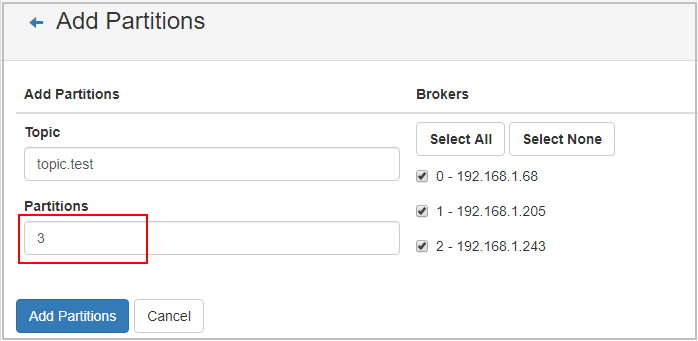

# 修改Topic分区数

创建Kafka实例Topic成功之后，您可以根据业务需要修改Topic的分区数。**分区数只支持增加，不支持减少**。

> **说明：** 
>修改分区数，不会影响业务。

修改Topic分区数的方法如下：

-   [方法1：在控制台修改](#section11349555102717)
-   [方法2：在Kafka Manager上修改](#section188405181310)

## 方法1：在控制台修改

1.  登录管理控制台。
2.  在管理控制台左上角单击，选择区域。

    > **说明：** 
    >此处请选择与您的应用服务相同的区域。

3.  在管理控制台左上角单击，选择“应用中间件 \> 分布式消息服务Kafka版”，进入分布式消息服务Kafka专享版页面。
4.  在“Kafka专享版”页面，单击Kafka专享版实例的名称，进入实例详情页面。
5.  选择“Topic管理”页签，显示已创建的Topic详情。
6.  在待修改分区数的Topic所在行，单击“编辑”，弹出“编辑Topic”对话框。

    > **说明：** 
    >如果需要批量修改分区数，勾选待修改分区数的Topic，单击Topic名称上方的“编辑Topic”。

7.  输入分区数，单击“确定”。

    > **说明：** 
    >-   分区数只支持增加，不支持减少。
    >-   出于性能考虑，Kafka控制台限定单个Topic的分区数上限为100。
    >-   所有Topic分区数总和不能超过实例允许的分区上限。

## 方法2：在Kafka Manager上修改

1.  [登录Kafka Manager](连接和查看Kafka-Manager.md#zh-cn_topic_0143117163_section14321822182915)。
2.  在Kafka Manager中，单击“Topic \> List”，进入Topic列表界面。
3.  单击Topic名称，进入Topic详情界面。
4.  单击“Add Partitions”，进入增加分区界面。

    **图 1**  Topic详情界面  
    

5.  输入分区数，单击“Add Partitions”。

    **图 2**  增加分区数量  
    

    显示“Done”，表示分区增加成功。

    **图 3**  分区增加成功  
    

    > **说明：** 
    >-   分区数只支持增加，不支持减少。
    >-   所有Topic分区数总和不能超过实例允许的分区上限。

