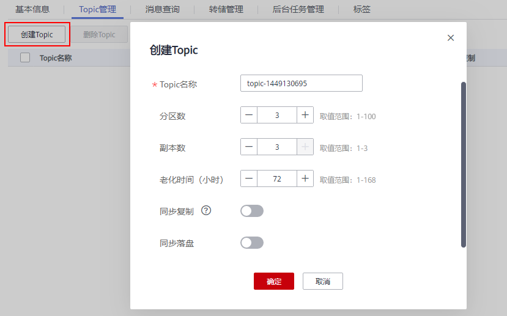
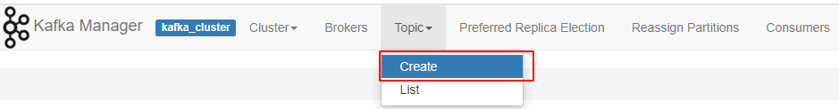

# 创建Topic<a name="kafka-ug-180604018"></a>

Topic，即消息主题。创建Kafka专享版实例成功后，如果没有开启“Kafka自动创建Topic”，需要手动创建Topic，然后才能进行生产消息和消费消息。如果实例开启了“Kafka自动创建Topic”，则该操作为可选，在进行生产时，会自动创建一个包含3个分区和3个副本的Topic。

本文主要介绍手动创建Topic的操作，有以下几种方式，您可以根据实际情况选择任意一种方式：

-   [方式1：在控制台创建](#section0249155910409)
-   [方式2：在Kafka Manager创建](#section1412315265201)
-   [方式3：在Kafka客户端上创建](#section1623746152018)

## 方式1：在控制台创建<a name="section0249155910409"></a>

1.  登录管理控制台。
2.  在管理控制台左上角单击，选择区域。

    > **说明：** 
    >此处请选择与您的应用服务相同的区域。

3.  在管理控制台左上角单击，选择“应用中间件 \> 分布式消息服务Kafka版”，进入分布式消息服务Kafka专享版页面。
4.  在“Kafka专享版”页面，单击Kafka专享版实例的名称。

    进入实例详情页面。

5.  选择“Topic管理”页签，单击“创建Topic”。

    弹出“创建Topic”对话框。

    **图 1**  创建Topic<a name="fig171592463454"></a>  
    

6.  填写Topic名称和配置信息。

    **表 1**  Topic参数说明

    <a name="table186364410350"></a>
    <table><thead align="left"><tr id="row66474473513"><th class="cellrowborder" valign="top" width="23%" id="mcps1.2.3.1.1"><p id="p7641944173520"><a name="p7641944173520"></a><a name="p7641944173520"></a>参数</p>
    </th>
    <th class="cellrowborder" valign="top" width="77%" id="mcps1.2.3.1.2"><p id="p264154419353"><a name="p264154419353"></a><a name="p264154419353"></a>说明</p>
    </th>
    </tr>
    </thead>
    <tbody><tr id="row8641444183514"><td class="cellrowborder" valign="top" width="23%" headers="mcps1.2.3.1.1 "><p id="p12649444358"><a name="p12649444358"></a><a name="p12649444358"></a>Topic名称</p>
    </td>
    <td class="cellrowborder" valign="top" width="77%" headers="mcps1.2.3.1.2 "><p id="p886312445210"><a name="p886312445210"></a><a name="p886312445210"></a>系统为您自动生成了Topic名称，您可以根据需要修改。</p>
    <p id="p19863142405214"><a name="p19863142405214"></a><a name="p19863142405214"></a>创建Topic后不能修改名称。</p>
    </td>
    </tr>
    <tr id="row196494414358"><td class="cellrowborder" valign="top" width="23%" headers="mcps1.2.3.1.1 "><p id="p10641644103512"><a name="p10641644103512"></a><a name="p10641644103512"></a>分区数</p>
    </td>
    <td class="cellrowborder" valign="top" width="77%" headers="mcps1.2.3.1.2 "><p id="p1064194443517"><a name="p1064194443517"></a><a name="p1064194443517"></a>您可以设置Topic的分区数，分区数越大消费的并发度越大。</p>
    <p id="p515812152115"><a name="p515812152115"></a><a name="p515812152115"></a>该参数设置为1时，消费消息时会按照先入先出的顺序进行消费。</p>
    <p id="p14572074216"><a name="p14572074216"></a><a name="p14572074216"></a>取值范围：</p>
    <p id="p49191315152018"><a name="p49191315152018"></a><a name="p49191315152018"></a>默认值：3</p>
    </td>
    </tr>
    <tr id="row764164413519"><td class="cellrowborder" valign="top" width="23%" headers="mcps1.2.3.1.1 "><p id="p2647442357"><a name="p2647442357"></a><a name="p2647442357"></a>副本数</p>
    </td>
    <td class="cellrowborder" valign="top" width="77%" headers="mcps1.2.3.1.2 "><p id="p133039601910"><a name="p133039601910"></a><a name="p133039601910"></a>您可以为每个Topic设置副本的数量，Kafka会自动在每个副本上备份数据，当其中一个Broker故障时数据依然是可用的，副本数越大可靠性越高。</p>
    <p id="p155911384258"><a name="p155911384258"></a><a name="p155911384258"></a>该参数设置为1时，表示只有一份数据。</p>
    <p id="p1420827152712"><a name="p1420827152712"></a><a name="p1420827152712"></a>取值范围：1-3</p>
    <p id="p74201827182717"><a name="p74201827182717"></a><a name="p74201827182717"></a>默认值：3</p>
    </td>
    </tr>
    <tr id="row464194417358"><td class="cellrowborder" valign="top" width="23%" headers="mcps1.2.3.1.1 "><p id="p136464453511"><a name="p136464453511"></a><a name="p136464453511"></a>老化时间（小时）</p>
    </td>
    <td class="cellrowborder" valign="top" width="77%" headers="mcps1.2.3.1.2 "><p id="p166412448357"><a name="p166412448357"></a><a name="p166412448357"></a>Topic中的消息超过老化时间后，消息将会被删除，老化的消息无法被消费。</p>
    <p id="p1367151412910"><a name="p1367151412910"></a><a name="p1367151412910"></a>取值范围：1-168</p>
    <p id="p885211915294"><a name="p885211915294"></a><a name="p885211915294"></a>默认值：72</p>
    </td>
    </tr>
    <tr id="row24651137132"><td class="cellrowborder" valign="top" width="23%" headers="mcps1.2.3.1.1 "><p id="p646518311134"><a name="p646518311134"></a><a name="p646518311134"></a>同步复制</p>
    </td>
    <td class="cellrowborder" valign="top" width="77%" headers="mcps1.2.3.1.2 "><p id="p5290129194418"><a name="p5290129194418"></a><a name="p5290129194418"></a>指后端收到生产消息请求并复制给所有副本后，才返回客户端。</p>
    <p id="p177312016154417"><a name="p177312016154417"></a><a name="p177312016154417"></a>开启同步复制后，需要在客户端配置acks=-1，否则无效。</p>
    <p id="p6199143215378"><a name="p6199143215378"></a><a name="p6199143215378"></a>当副本数为1时，不能选择同步复制功能。</p>
    </td>
    </tr>
    <tr id="row564184403515"><td class="cellrowborder" valign="top" width="23%" headers="mcps1.2.3.1.1 "><p id="p9641944123515"><a name="p9641944123515"></a><a name="p9641944123515"></a>同步落盘</p>
    </td>
    <td class="cellrowborder" valign="top" width="77%" headers="mcps1.2.3.1.2 "><p id="p1164144413516"><a name="p1164144413516"></a><a name="p1164144413516"></a>同步落盘是指生产的每条消息都会立即写入磁盘。</p>
    <p id="p121511193711"><a name="p121511193711"></a><a name="p121511193711"></a>开启：生产的每条消息都会立即写入磁盘，可靠性更高。</p>
    <p id="p0289112616719"><a name="p0289112616719"></a><a name="p0289112616719"></a>关闭：生产的消息存在内存中，不会立即写入磁盘。</p>
    </td>
    </tr>
    </tbody>
    </table>

7.  配置完成后，单击“确定”，完成创建Topic。

## 方式2：在Kafka Manager创建<a name="section1412315265201"></a>

登录Kafka Manager后，在页面顶部选择“Topic \> Create”，然后按照界面参数填写即可。

**图 2**  在Kafka Manager中创建Topic<a name="fig172231816191615"></a>  


## 方式3：在Kafka客户端上创建<a name="section1623746152018"></a>

仅在Kafka客户端版本为**2.2以上**时，支持通过**kafka-topics.sh**创建Topic，以及管理Topic的各类参数。

-   未开启SASL的Kafka专享版实例，通过以下命令创建Topic。

    ```
    kafka-topics.sh --create --topic {topic_name} --bootstrap-server {broker_ip}:{port} --partitions {partition_num} --replication-factor {replication_num}
    ```

-   已开启SASL的Kafka专享版实例，通过以下步骤创建Topic。
    1.  在Kafka客户端的“/config”目录中创建“ssl-user-config.properties”文件，参考[2](连接已开启SASL的Kafka专享版实例.md#li5414277457)增加SSL证书配置。
    2.  通过以下命令创建Topic。

        ```
        kafka-topics.sh --create --topic {topic_name} --bootstrap-server {broker_ip}:{port} --partitions {partition_num} --replication-factor {replication_num} --command-config ./config/ssl-user-config.properties 
        ```


