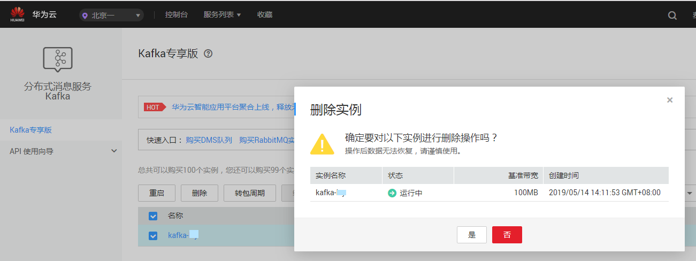

# 删除实例

## 操作场景

分布式消息服务管理控制台支持删除重启Kafka专享版实例，且可实现批量删除重启Kafka专享版实例、一键式删除创建失败的重启Kafka专享版实例。

> **警告：**   
>Kafka专享版实例删除后，实例中原有的数据将被删除，且没有备份，请谨慎操作。  

## 前提条件

-   Kafka专享版实例已存在。
-   Kafka专享版实例状态为运行中、故障、已冻结的按需付费实例才能执行删除操作。
-   包年/包月类型的Kafka专享版实例，不支持进行删除和批量删除操作。若不再使用，可单击“操作”栏下的“更多 \> 退订”进行退订。

## 删除Kafka专享版实例

1.  登录管理控制台。
2.  在管理控制台左上角单击，选择区域。

    > **说明：**   
    >此处请选择与您的应用服务相同的区域。  

3.  单击页面上方的“服务列表”，选择“应用服务 \> 分布式消息服务Kafka”，进入分布式消息服务Kafka专享版页面。
4.  勾选“名称”栏下的需要删除的Kafka专享版实例左侧的方框，可选一个或多个。

    Kafka专享版实例状态为创建中、启动中、变更中、变更失败、重启中时不允许执行删除操作。

5.  单击信息栏左上侧的“删除”。
6.  单击“是”，完成删除Kafka专享版实例。

    删除Kafka专享版实例大约需要1到30分钟。

    > **说明：**   
    >如果只需要删除单个Kafka专享版实例，也可以在“Kafka专享版”界面，单击指定Kafka专享版实例右侧“操作”栏下的“删除”。  

    **图 1**  删除Kafka专享版实例  
    

## 删除创建失败的Kafka专享版实例

1.  登录管理控制台。
2.  在管理控制台左上角单击，选择区域。

    > **说明：**   
    >此处请选择与您的应用服务相同的区域。  

3.  单击页面上方的“服务列表”，选择“应用服务 \> 分布式消息服务 Kafka”，进入分布式消息服务Kafka专享版页面。

    若当前存在创建失败的Kafka专享版实例，界面信息栏会显示“创建失败任务”及失败数量信息。

4.  单击“创建失败任务”后的图标或者数量。

    弹出“创建失败任务”界面。

5.  在“创建失败任务”界面删除创建失败的Kafka专享版实例。
    -   单击“清理失败任务”按钮，一键式删除所有创建失败的Kafka专享版实例。
    -   单击需要删除的Kafka专享版实例右侧的“删除任务”，依次删除创建失败的Kafka专享版实例。

