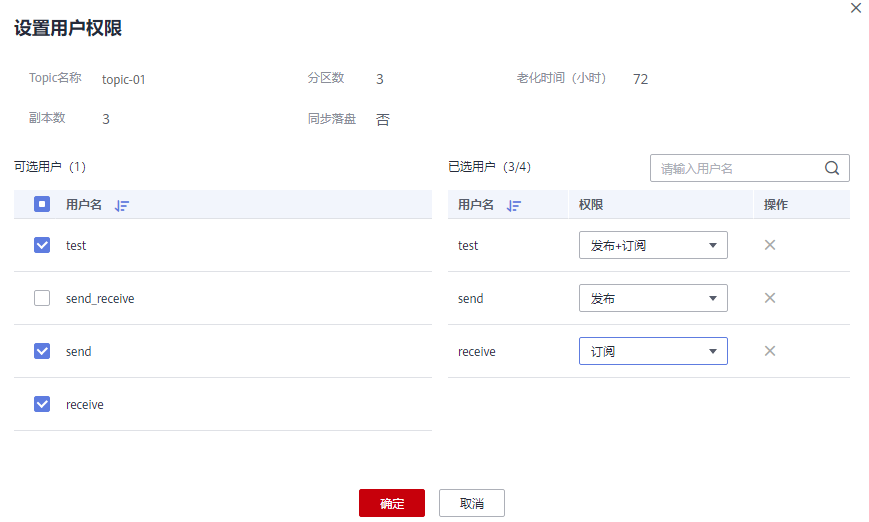
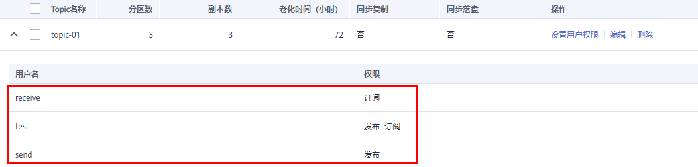

# 授权SASL\_SSL用户

Kafka专享版实例开启SASL\_SSL后，在Topic中为SASL\_SSL用户设置不同的权限，以达到SASL\_SSL用户之间的权限隔离。

如果Topic并未授权任何SASL\_SSL用户，此时所有的SASL\_SSL用户都可以订阅/发布此Topic。

如果Topic已授权某一个或多个SASL\_SSL用户，此时只有授权的SASL\_SSL用户可以订阅/发布此Topic，其他未授权的SASL\_SSL用户不能订阅/发布此Topic。

## 前提条件

-   创建Kafka专享版实例时，已开启SASL\_SSL功能。
-   （可选）已[创建SASL\_SSL用户](创建SASL_SSL用户.md)。

## 操作步骤

1.  登录管理控制台。
2.  在管理控制台左上角单击，选择区域。

    > **说明：** 
    >此处请选择与您的应用服务相同的区域。

3.  在管理控制台左上角单击，选择“应用中间件 \> 分布式消息服务Kafka版”，进入分布式消息服务Kafka专享版页面。
4.  单击Kafka专享版实例名称，进入实例详情页面。
5.  在“Topic管理”页签，在需要设置用户权限的Topic所在行，单击“设置用户权限”，弹出“设置用户权限”对话框。
6.  在“可选用户”区域，勾选需要订阅/发布此Topic的用户名。在“已选用户”区域，为用户设置不同的权限。

    **图 1**  设置用户权限  
    

    如[图1](#fig1085124516513)所示，此时只有“test”、“send”和“receive”用户可以订阅/发布topic-01，“send\_receive”用户无法订阅/发布topic-01。

7.  单击“确定”，完成为SASL\_SSL用户的授权。

    完成授权后，在Topic名称前单击，查看已经授权的用户及其对应的权限。

    **图 2**  查看已经授权的用户及其对应的权限  
    

