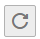

# 查看实例后台任务

对实例的一些操作，如修改公网访问开关、修改容量阈值策略等，会启动一个后台任务，您可以在后台任务页，查看该操作的状态等信息，同时可通过删除操作，清理任务信息。

## 操作步骤

1.  登录管理控制台。
2.  在管理控制台左上角单击，选择区域。

    > **说明：**   
    >此处请选择与您的应用服务相同的区域。  

3.  单击页面上方的“服务列表”，选择“应用服务 \> 分布式消息服务”，进入分布式消息服务Kafka专享版页面。
4.  单击Kafka专享版实例的名称，进入实例的“基本信息”页签。
5.  单击“后台任务管理”页签，进入后台任务管理页面。

    界面显示任务列表。

6.  单击，选择“开始日期”和“结束日期”，单击“确认”，界面显示相应时间段内启动的任务。
    -   单击，刷新任务状态。
    -   单击“操作”栏下的“删除”，清理任务信息。

        > **说明：**   
        >您只能在任务已经执行完成，即任务状态为成功或者失败时，才能执行删除操作。  

