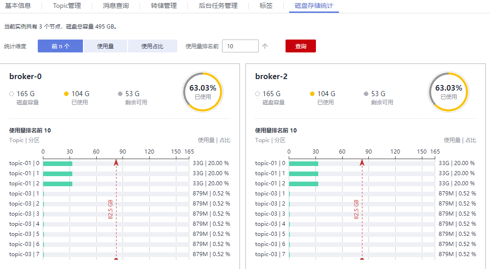

# 查看磁盘使用量

本章节指导您在控制台查看每个代理上磁盘的使用量。

## 操作步骤

1.  登录管理控制台。
2.  在管理控制台左上角单击，选择区域。

    > **说明：** 
    >此处请选择与您的应用服务相同的区域。

3.  在管理控制台左上角单击，选择“应用中间件 \> 分布式消息服务Kafka版”，进入分布式消息服务Kafka专享版页面。
4.  单击Kafka专享版实例的名称，进入实例的“基本信息”页签。
5.  在“磁盘存储统计”页签，查看磁盘的使用量。

    **图 1**  查看磁盘的使用量  
    

    页面支持从以下三个方面对代理中的Topic磁盘使用量进行查询：使用量排名前_xx_个、使用量达到_xx_  GB和使用占比达_xx_%。

