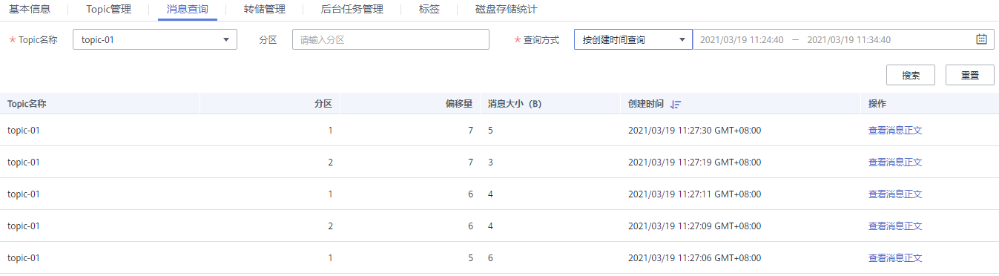

# 查询消息

## 操作场景

您可以查看指定Topic的消息大小、创建时间以及消息正文。

## 操作步骤

1.  登录管理控制台。
2.  在管理控制台左上角单击，选择区域。

    > **说明：**   
    >此处请选择与您的应用服务相同的区域。  

3.  单击页面上方的“服务列表”，选择“应用服务 \> 分布式消息服务 Kafka”，进入分布式消息服务Kafka专享版页面。
4.  在实例所在行，单击实例名称，进入实例详情页面。
5.  选择“消息查询”页签，在消息页签页面，设置查询的Topic名称以及查询方式。

    查询方式支持以下两种方式：

    -   按创建时间查询：即按生产该消息的时间。
    -   按偏移量查询：即记录消息的位置。

    查询结果如下：

    **图 1**  查询Topic消息  
    

    您还可以消息列的“查看消息正文”，查看具体的消息信息。

