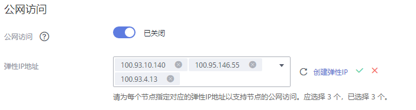

# 设置实例公网访问

您需要通过公网地址访问Kafka实例时，可开启实例的公网访问功能，并设置公网带宽。当开启成功后，您还可以修改公网带宽的大小，当前仅支持带宽扩容，不支持缩容。

同时，当业务不再使用公网访问功能时，也可以关闭实例的公网访问功能。

> **说明：** 
>公网访问支持的区域如下：华北-北京一、华北-北京四、华东-上海一、华东-上海二、华南-广州，**其中部分区域不支持“基准带宽”为“100MB/s”的Kafka实例开启公网访问，具体以控制台为准**。

## 操作步骤

1.  登录管理控制台。
2.  在管理控制台左上角单击，选择区域。

    > **说明：** 
    >此处请选择与您的应用服务相同的区域。

3.  在管理控制台左上角单击，选择“应用中间件 \> 分布式消息服务Kafka版”，进入分布式消息服务Kafka专享版页面。
4.  单击Kafka专享版实例的名称，进入实例的“基本信息”页签。
5.  设置公网访问。

    > **说明：** 
    >-   只有处于“运行中”状态的Kafka专享实例支持修改公网访问配置。
    >-   Kafka专享实例只支持绑定IPv4弹性IP地址。

    **开启公网访问。**

    在“公网访问”后，单击，开启公网访问。在“弹性IP地址”中，为每个代理设置对应的弹性IP地址，单击。

    您可以在实例的“后台任务管理”页面，查看当前任务的操作进度。任务状态为“成功”，表示操作成功。

    **图 1**  公网访问  
    

    开启公网访问后，需要设置对应的[安全组规则](#table161395381402)，才能成功连接Kafka。连接Kafka的具体操作请参考[连接Kafka](连接Kafka.md)。

    **表 1**  安全组规则

    
    <table><thead align="left"><tr id="row17137538605"><th class="cellrowborder" valign="top" width="13.211321132113211%" id="mcps1.2.6.1.1">
方向

    </th>
    <th class="cellrowborder" valign="top" width="15.151515151515152%" id="mcps1.2.6.1.2">
协议

    </th>
    <th class="cellrowborder" valign="top" width="15.151515151515152%" id="mcps1.2.6.1.3">
端口

    </th>
    <th class="cellrowborder" valign="top" width="18.02180218021802%" id="mcps1.2.6.1.4">
源地址

    </th>
    <th class="cellrowborder" valign="top" width="38.46384638463846%" id="mcps1.2.6.1.5">
说明

    </th>
    </tr>
    </thead>
    <tbody><tr id="row1313811381103"><td class="cellrowborder" valign="top" width="13.211321132113211%" headers="mcps1.2.6.1.1 ">
入方向

    </td>
    <td class="cellrowborder" valign="top" width="15.151515151515152%" headers="mcps1.2.6.1.2 ">
TCP

    </td>
    <td class="cellrowborder" valign="top" width="15.151515151515152%" headers="mcps1.2.6.1.3 ">
9094

    </td>
    <td class="cellrowborder" valign="top" width="18.02180218021802%" headers="mcps1.2.6.1.4 ">
0.0.0.0/0

    </td>
    <td class="cellrowborder" valign="top" width="38.46384638463846%" headers="mcps1.2.6.1.5 ">
通过公网访问Kafka（关闭SSL加密）。

    </td>
    </tr>
    <tr id="row131381384015"><td class="cellrowborder" valign="top" width="13.211321132113211%" headers="mcps1.2.6.1.1 ">
入方向

    </td>
    <td class="cellrowborder" valign="top" width="15.151515151515152%" headers="mcps1.2.6.1.2 ">
TCP

    </td>
    <td class="cellrowborder" valign="top" width="15.151515151515152%" headers="mcps1.2.6.1.3 ">
9095

    </td>
    <td class="cellrowborder" valign="top" width="18.02180218021802%" headers="mcps1.2.6.1.4 ">
0.0.0.0/0

    </td>
    <td class="cellrowborder" valign="top" width="38.46384638463846%" headers="mcps1.2.6.1.5 ">
通过公网访问Kafka（开启SSL加密）。

    </td>
    </tr>
    <tr id="row14198453269"><td class="cellrowborder" valign="top" width="13.211321132113211%" headers="mcps1.2.6.1.1 ">
入方向

    </td>
    <td class="cellrowborder" valign="top" width="15.151515151515152%" headers="mcps1.2.6.1.2 ">
TCP

    </td>
    <td class="cellrowborder" valign="top" width="15.151515151515152%" headers="mcps1.2.6.1.3 ">
9999

    </td>
    <td class="cellrowborder" valign="top" width="18.02180218021802%" headers="mcps1.2.6.1.4 ">
0.0.0.0/0

    </td>
    <td class="cellrowborder" valign="top" width="38.46384638463846%" headers="mcps1.2.6.1.5 ">
访问Kafka Manager。

    </td>
    </tr>
    </tbody>
    </table>

    **关闭公网访问。**

    关闭公网访问目前在控制台上存在两种情况：

    -   上线弹性IP地址前创建的实例，按照以下步骤关闭公网访问。
        1.  在“公网访问”后，单击，跳转到公网访问变更页面。
        2.  单击，单击“提交”，完成公网访问的关闭。

            您可以在实例的“后台任务管理”页面，查看当前任务的操作进度。任务状态为“成功”，表示操作成功。

    -   上线弹性IP地址后创建的实例，按照以下步骤关闭公共访问。
        1.  在“公网访问”后，单击，完成公网访问的关闭。

            您可以在实例的“后台任务管理”页面，查看当前任务的操作进度。任务状态为“成功”，表示操作成功。

