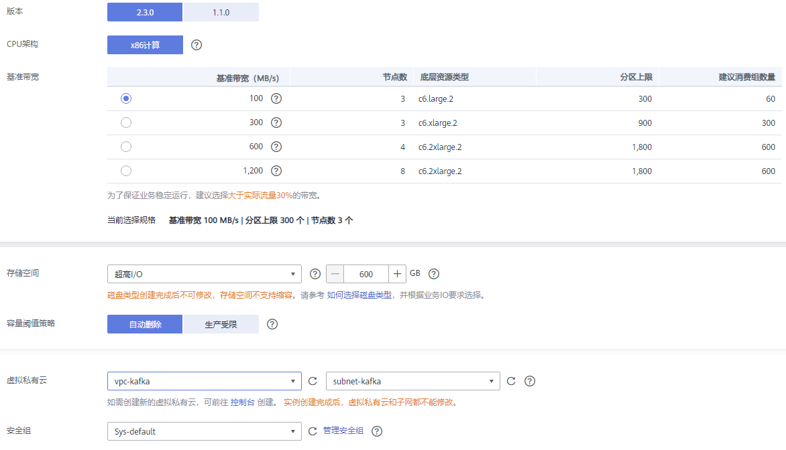

# 购买实例

## 操作场景

目前，DMS提供Kafka专享版实例的服务，Kafka专享版实例采用物理隔离的方式部署，租户独占Kafka实例。支持用户自定义规格和自定义特性，您可以根据业务需要定制相应计算能力和存储空间的Kafka实例。

## 购买前须知

-   Kafka专享版实例运行于虚拟私有云，购买实例前，需保证有可用的虚拟私有云，并且已配置好安全组与子网。
-   实例不同规格的节点数和底层资源相关。由于不同Region，底层资源不一样，实例创建后，实例节点数也会不一样。

## 操作步骤

1.  登录管理控制台。
2.  在管理控制台左上角单击，选择区域。

    > **说明：** 
    >此处请选择与您的应用服务相同的区域。

3.  在管理控制台左上角单击，选择“应用中间件 \> 分布式消息服务Kafka版”，进入分布式消息服务Kafka专享版页面。
4.  单击页面右上方的“购买Kafka实例”。

    每个项目默认最多可以创建100个Kafka专享版实例，如果您想创建更多实例，请联系客服申请增加配额。

5.  选择“计费模式”、“区域”、“项目”和“可用区”。
6.  设置“实例名称”和“企业项目”。
7.  设置实例信息。

    1.  版本：Kafka的版本号，当前支持1.1.0和2.3.0，根据实际情况选择，推荐使用2.3.0。
    2.  CPU架构：当前仅支持“x86计算”，保持默认值即可。
    3.  当前控制台存在2种规格，具体如下：
        -   在除华东-上海一、华东-上海二、华北-北京四和华南-广州以外的区域，在“基准带宽”中，请根据业务流量选择带宽。

            选择基准带宽时，可以查看此带宽对应的底层ECS数量和规格、分区上限、以及建议的消费组数量。

            分区上限指Kafka专享版实例可创建的最大分区总数。当所有Topic的总分区数大于此值时，创建Topic失败。

        -   在华东-上海一、华东-上海二、华北-北京四和华南-广州区域，在“规格”中，请根据业务需求选择相应的代理规格。在“代理个数”中，选择代理个数。

            单个代理最大分区数\*代理个数=实例分区数上限。当所有Topic的总分区数大于实例分区数上限时，创建Topic失败。

    4.  在“存储空间”区域，您根据实际需要选择存储Kafka数据的总磁盘大小。

        创建实例时会进行磁盘格式化，磁盘格式化会导致实际可用磁盘为总磁盘的93%\~95%。

        -   基准带宽为100MB/s时，存储空间取值范围：600GB \~ 90000GB。
        -   基准带宽为300MB/s时，存储空间取值范围：1200GB \~ 90000GB。
        -   基准带宽为600MB/s时，存储空间取值范围：2400GB \~ 90000GB。
        -   基准带宽为1200MB/s时，存储空间取值范围：4800GB \~ 90000GB。

        > **说明：** 
        >-   高IO + 100MB/s带宽：假设平均每条消息1KB，则高吞吐场景可达10万条/秒，同步复制场景可达6万条/秒。
        >-   高IO + 300MB/s带宽 :  假设平均每条消息1KB，则高吞吐场景下可达30万条/秒，同步复制场景可达15万条/秒。
        >-   超高IO + 100MB/s带宽：假设平均每条消息1KB，则高吞吐场景可达10万条/秒，同步复制场景可达8万条/秒。
        >-   超高IO + 300MB/s带宽：假设平均每条消息1KB，则高吞吐场景可达30万条/秒，同步复制场景可达20万条/秒。
        >-   超高IO + 600MB/s带宽：假设平均每条消息1KB，则高吞吐场景可达60万条/秒，同步复制场景可达30万条/秒。
        >-   超高IO + 1200MB/s带宽：假设平均每条消息1KB，则高吞吐场景可达120万条/秒，同步复制场景可达40万条/秒。

    5.  在“容量阈值策略”区域，设置磁盘使用达到容量阈值后的消息处理策略，容量阈值默认为95%。
        -   自动删除：可以正常生产和消费消息，但是会删除最早的10%的消息，以保证磁盘容量充足。
        -   生产受限：无法继续生产消息，但可以继续消费消息。

    6.  在“虚拟私有云”下拉列表，选择已经创建好的虚拟私有云和子网。

        虚拟私有云可以为您的Kafka专享实例构建隔离的、能自主配置和管理的虚拟网络环境。

        > **说明：** 
        >-   建议选择未开启IPv6的子网，Kafka专享版实例使用开启IPv6的子网后，无法开启公网访问。
        >-   虚拟私有云和子网在Kafka专享版实例创建完成后，不支持修改。

    7.  在“安全组”下拉列表，可以选择已经创建好的安全组。

        安全组是一组对弹性云服务器的访问规则的集合，为同一个VPC内具有相同安全保护需求并相互信任的弹性云服务器提供访问策略。

        您可以单击右侧的“管理安全组”，跳转到网络控制台的“安全组”页面，查看或创建安全组。

    **图 1**  购买Kafka专享版实例  
    

8.  设置登录Kafka Manager的用户名和密码。

    Kafka Manager是开源的kafka集群管理工具，实例创建成功后，实例详情页面会展示Kafka Manager登录地址，您可登录Kafka Manager页面，查看Kafka集群的监控、代理等信息。

9.  设置实例购买时长。

    当选择了“包年/包月”付费模式时，页面才显示“购买时长”参数，您需要根据业务需要选择。

10. 单击“更多配置”，设置更多相关信息。
    1.  设置“公网访问”。

        “公网访问”默认为关闭状态，您可以选择是否开启。

        开启公网访问后，还需要为每个代理设置对应的IPv4弹性IP地址。

        > **说明：** 
        >公网访问支持的区域如下：华北-北京一、华北-北京四、华东-上海一、华东-上海二和华南-广州。

    2.  选择是否开启转储。

        通过开启转储将数据转储至OBS桶，实现数据的备份。

        > **说明：** 
        >-   消息包含消息属性（由属性名及属性值组成，以K-V的形式体现）时，属性名key不支持转储，属性值value支持转储。
        >-   开启转储后，暂不支持关闭转储。

    3.  设置“Kafka SASL\_SSL”。

        客户端连接Kafka专享版实例时，是否开启SSL认证。开启Kafka SASL\_SSL，则数据加密传输，安全性更高。

        **创建实例后，Kafka SASL\_SSL开关不支持修改**，请慎重选择。如果创建后需要修改，需要重新创建实例。

        开启Kafka SASL\_SSL后，您需要设置连接Kafka专享版实例的用户名和密码。

    4.  设置“Kafka自动创建Topic”。

        选择开启“Kafka自动创建Topic”，表示生产或消费一个未创建的Topic时，会自动创建一个包含3个分区和3个副本的Topic。

    5.  设置“标签”。

        标签用于标识云资源，当您拥有相同类型的许多云资源时，可以使用标签按各种维度（例如用途、所有者或环境）对云资源进行分类。

        -   如果您已经预定义了标签，在“标签键”和“标签值”中选择已经定义的标签键值对。另外，您可以单击“查看预定义标签”，跳转到标签管理服务页面，查看已经预定义的标签，或者创建新的标签。
        -   您也可以直接在“标签键”和“标签值”中设置标签。

        当前每个Kafka实例最多支持设置20个不同标签，标签的命名规格，请参考[管理实例标签](管理实例标签.md)章节。

        > **说明：** 
        >部分区域不支持标签功能，请以控制台为准。

    6.  设置实例的描述信息。

11. 填写完上述信息后，单击“立即购买”，进入规格确认页面。
12. 确认实例信息无误且阅读并同意《华为云用户协议》后，单击“去支付”。
13. 单击“返回Kafka专享版”，查看Kafka专享版实例是否创建成功。

    创建实例大约需要3到15分钟，此时实例的“状态”为“创建中”。

    -   当实例的“状态”变为“运行中”时，说明实例创建成功。
    -   如果创建实例失败，在信息栏的“创建失败任务”中查看创建失败的实例。请参考[删除实例](删除实例.md)，删除创建失败的实例，然后重新创建。如果重新创建仍然失败，请联系客服。

        > **说明：** 
        >创建失败的实例，不会占用其他资源。

