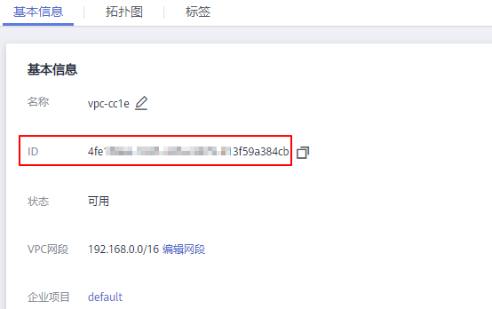

# 跨VPC访问Kafka专享版实例<a name="kafka-ug-0001"></a>

## 操作场景<a name="section128927211065"></a>

Kafka客户端和Kafka专享版实例在同一区域的不同VPC中，由于VPC之间逻辑隔离，Kafka客户端和Kafka专享版实例不能直接通信。您可以通过以下任意一个方式实现跨VPC访问：

-   创建VPC对等连接，将两个VPC的网络打通，实现跨VPC访问。具体步骤请参考[VPC对等连接说明](https://support.huaweicloud.com/usermanual-vpc/vpc_peering_0000.html)。
-   创建一个云连接实例，然后在创建的云连接实例中加载需要互通的VPC，实现跨VPC访问。具体步骤请参考[同区域同帐号VPC互通](https://support.huaweicloud.com/qs-cc/cc_02_0101.html)。
-   利用VPC终端节点在不同VPC间建立跨VPC的连接通道，实现Kafka客户端通过内网访问Kafka专享版实例。

本章节主要介绍通过VPC终端节点实现跨VPC访问的方法。

VPC终端节点由“终端节点服务”和“终端节点”两种资源实例组成。

-   终端节点服务：将Kafka专享版实例配置为VPC终端节点支持的服务，可以被终端节点连接和访问。
-   终端节点：用于在VPC和终端节点服务之间建立便捷、安全、私密的连接通道。

**图 1**  跨VPC访问Kafka专享版实例原理图<a name="fig17225659161619"></a>  


## 操作流程<a name="section1677691110218"></a>

**图 2**  跨VPC访问Kafka专享版实例流程图<a name="fig6170104412359"></a>  


## 创建终端节点服务<a name="section171840351866"></a>

1.  登录管理控制台。
2.  在管理控制台左上角单击，选择区域。

    > **说明：** 
    >此处请选择与您的应用服务相同的区域。

3.  在管理控制台左上角单击，选择“应用中间件 \> 分布式消息服务Kafka版”，进入分布式消息服务Kafka专享版页面。
4.  单击Kafka专享版实例名称，进入实例详情页面。
5.  <a name="li1470016488194"></a>获取Kafka专享版实例的地址和对应的Port ID。

    **图 3**  获取Kafka专享版实例的地址和对应的Port ID<a name="fig323641010392"></a>  
    

6.  查看Kafka专享版实例所在的VPC名称。

    **图 4**  查看Kafka专享版实例所在的VPC名称<a name="fig23264316235"></a>  
    

7.  <a name="li19701310122315"></a>单击VPC名称，进入VPC基本信息页签，获取VPC ID。

    **图 5**  获取VPC ID<a name="fig1785012252814"></a>  
    

8.  <a name="li11323122315289"></a>调用VPC终端节点的API创建终端节点服务，API详情请参考[创建终端节点服务](https://support.huaweicloud.com/api-vpcep/vpcep_06_0201.html)。

    ```
    curl -i -k -H 'Accept:application/json' -H 'Content-Type:application/json;charset=utf8' -X POST -H "X-Auth-Token:$token" -d '{"port_id":"38axxxeac","vpc_id":"581xxxeac","ports":[{"protocol":"TCP","client_port":9011,"server_port":9011 }],"approval_enabled":false,"service_type":"interface","server_type":"VM"}' https://{endpoint}/v1/{project_id}/vpc-endpoint-services
    ```

    参数说明如下：

    -   token：Token是系统颁发给IAM用户的访问令牌，承载用户的身份、权限等信息，获取方法请参考[获取用户Token](https://support.huaweicloud.com/api-iam/iam_30_0001.html)。
    -   port\_id：输入[5](#li1470016488194)中获取的其中一个Port ID。
    -   vpc\_id：输入[7](#li19701310122315)中获取的VPC ID。
    -   endpoint：获取[VPC终端节点的终端节点](https://developer.huaweicloud.com/endpoint?VPCEP)，区域必须与Kafka专享版实例保持一致。
    -   project\_id：获取[VPC终端节点的项目ID](https://support.huaweicloud.com/api-vpcep/vpcep_08_0003.html)，区域必须与Kafka专享版实例保持一致。

    记录终端节点服务的名称，终端节点服务的名称由**region+.+serviceId**构成，例如：cn-north-4.4189d3c2-8882-4871-a3c2-d380272eed83。

    -   region：从[VPC终端节点的终端节点](https://developer.huaweicloud.com/endpoint?VPCEP)获取。
    -   serviceId：从响应消息中获取终端节点服务的ID。

9.  <a name="li7368125918119"></a>参考[8](#li11323122315289)，为[5](#li1470016488194)中其他Port ID创建终端节点服务，并记录终端节点服务的名称。

## （可选）添加白名单<a name="section386115711369"></a>

Kafka客户端和Kafka专享版实例属于不同帐号时，将Kafka客户端所在帐号的ID添加到终端节点服务的白名单中，完成跨帐号终端节点的访问授权，具体操作步骤请参考[添加白名单](https://support.huaweicloud.com/qs-vpcep/vpcep_02_02034.html)。

## 购买终端节点<a name="section1649245213366"></a>

1.  <a name="li182701720183719"></a>在管理控制台左上角单击，选择“网络 \> VPC终端节点”，进入终端节点页面。
2.  单击“购买终端节点”，进入“购买终端节点”页面。
3.  设置如下参数。

    -   区域：与Kafka专享版实例保持一致。
    -   服务类别：选择“按名称查找服务”。
    -   服务名称：输入[8](#li11323122315289)中记录的终端节点服务名称，单击“验证”。显示“已找到服务”后，继续后续操作。
    -   虚拟私有云：选择Kafka客户端所属的VPC。
    -   子网：选择Kafka客户端所属的子网。
    -   节点IP：选择“自动分配”。

    其他参数保持默认，如果想要了解更多的参数信息，请参考[购买终端节点](https://support.huaweicloud.com/usermanual-vpcep/zh-cn_topic_0131645189.html)。

    **图 6**  终端节点参数设置<a name="fig84120408277"></a>  
    

4.  单击“立即购买”，进入规格确认页面。
5.  确认无误后，提交请求。
6.  购买成功后，返回终端节点页面，查看终端节点状态是否为“已接受”，“已接受”表示终端节点已成功连接至终端节点服务。

    **图 7**  查看终端节点状态<a name="fig19145522114715"></a>  
    

7.  <a name="li1942253845112"></a>单击终端节点ID，在“基本信息”页签，查看并记录节点IP。

    您可以使用节点IP访问终端节点服务，进行跨VPC资源通信。

    **图 8**  查看节点IP<a name="fig1468113918579"></a>  
    

8.  <a name="li923645116109"></a>参考[1](#li182701720183719)\~[7](#li1942253845112)，为[9](#li7368125918119)中创建的终端节点服务购买终端节点，查看并记录节点IP。

## 修改advertised.listeners IP<a name="section159510175154"></a>

1.  在管理控制台左上角单击，选择“应用中间件 \> 分布式消息服务Kafka版”，进入分布式消息服务Kafka专享版页面。
2.  单击Kafka专享版实例名称，进入实例详情页面。
3.  在“基本信息”页签，修改“跨VPC访问”的advertised.listeners IP，advertised.listeners IP为[7](#li1942253845112)和[8](#li923645116109)中记录的节点IP。

    > **须知：** 
    >节点IP必须与Port ID一一对应，否则会导致网络不通。

    **图 9**  修改advertised.listeners IP<a name="fig17403121592620"></a>  
    


## 验证接口联通性<a name="section72114271643"></a>

参考[连接未开启SASL的Kafka专享版实例](连接未开启SASL的Kafka专享版实例.md)或者[连接已开启SASL的Kafka专享版实例](连接已开启SASL的Kafka专享版实例.md)，测试是否可以生产和消费消息。

