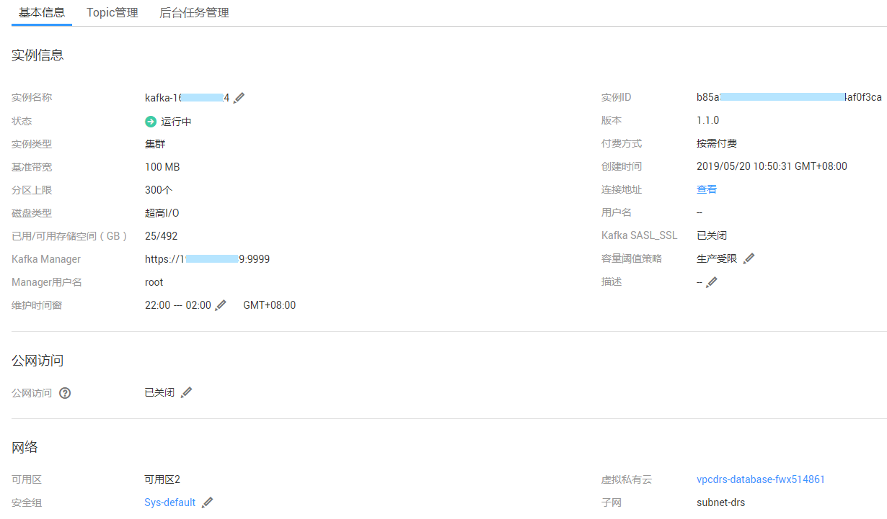
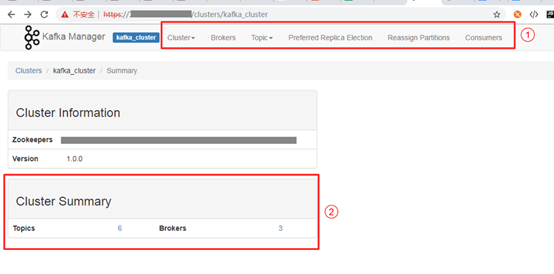
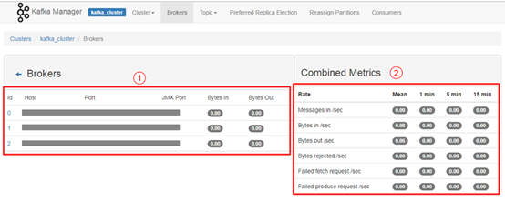
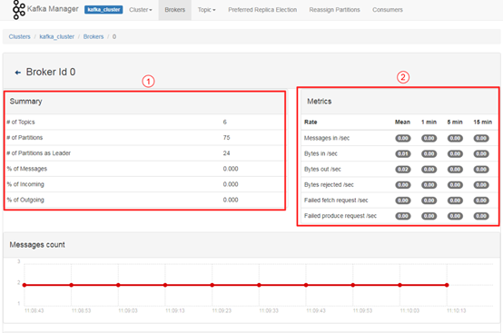
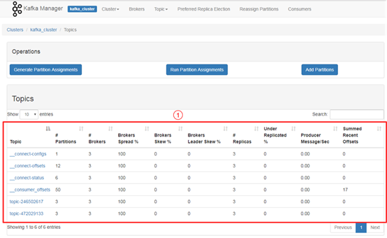
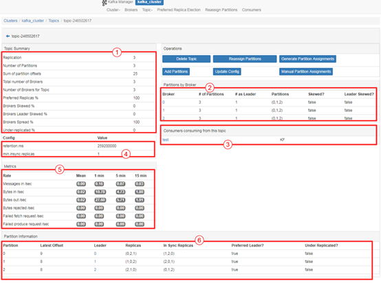
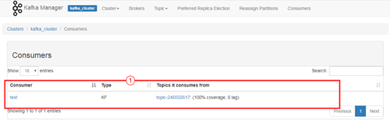
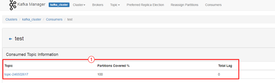
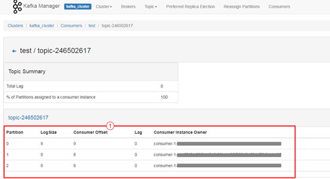

# 连接和查看Kafka Manager

Kafka Manager是开源的Kafka集群管理工具，需要通过浏览器才能访问Kafka Manager的地址。在Kafka Manager页面，您可以查看Kafka集群的监控、代理等信息。

## 前提条件

已正确配置[安全组](准备实例依赖资源.md)。

## 登录Kafka Manager

1.  （可选）创建一台与Kafka专享实例相同VPC和相同安全组的Windows服务器，详细步骤请参考《[购买并登录Windows弹性云服务器](https://support.huaweicloud.com/qs-ecs/zh-cn_topic_0021831611.html)》。

    如果是已经开启了公网访问，该步骤为可选，在本地浏览器中即可访问，不需要单独的Windows弹性云服务器。

2.  获取Kafka Manager地址。

    如[图1](#zh-cn_topic_0143117163_fig181443461517)所示，在实例详情信息页面，获取Kafka Manager的地址。

    **图 1**  获取Kafka Manager地址  
    

3.  在浏览器中输入Kafka Manager的地址，进入Kafka Manager登录页面。

    如果是开启了公网访问，在本地浏览器输入Kafka Manager地址访问；如果没有开启公网访问，需要登录[1](#zh-cn_topic_0143117163_li10494164794120)的弹性云服务器，然后在浏览器输入Kafka Manager地址访问。

4.  输入创建实例时设置的Kafka Manager用户名和密码，即可管理Kafka集群。

## 查看Kafka Manager

在进入Kafka Manger集群管理页面后，您可以查看Kafka集群的监控、代理等信息。

-   集群信息页

    单击**Clusters**中的集群列表，即可进入集群信息页。如[图2](#zh-cn_topic_0143117163_fig5401930101911)所示。

    -   图中①区域表示功能导航栏
        -   **Cluster**: 集群，统计集群列表和集群详情。
        -   **Brokers**: 代理，统计当前集群中各代理的状态信息。
        -   **Topic**: 队列，统计当前集群中的kafka队列。
        -   **Preferred Replica Election**: 强制进行一次队列leader的最优选举（不建议用户操作）。
        -   **Reassign Partitions**: 进行分区副本的重分配（不建议用户操作）。
        -   **Consumers**: 统计集群中的消费组状态。

    -   图中②区域表示集群信息统计，包含集群的Topic数和集群的代理数。

        **图 2**  集群信息页  
        

-   集群所有代理统计页

    单击功能导航栏中的**Brokers**，即可进入代理统计页。如[图3](#zh-cn_topic_0143117163_fig850454717515)所示。

    -   图中①区域代理列表，包含总的字节流入和字节流出。
    -   图中②集群监控信息。

        **图 3**  所有代理统计页  
        

-   具体代理统计页

    单击id列表中具体的Broker，即可查看对应代理的统计信息。如[图4](#zh-cn_topic_0143117163_fig1833012481468)所示。

    -   图中①区域表示对应代理总的统计信息，包括队列数、分区数、分区leader数、消息速率占比、写入字节占比以及流出字节占比。
    -   图中②区域表示代理监控信息。

        **图 4**  具体Broker信息  
        

-   查看实例的Topic

    在导航栏选择**Topic**，并在下拉列表中选择**List**。页面如[图5](#zh-cn_topic_0143117163_fig197812565918)所示，展示了队列列表以及分区数等。

    > **须知：** 
    >列表中以“\_\_”开头的队列为内部队列，严禁操作，否则可能导致业务问题。

    **图 5**  查看实例的Topic  
    

-   队列详情页

    单击具体的Topic名称，进入如[图6](#zh-cn_topic_0143117163_fig17368181052113)所示页面。

    -   图中①区域表示队列基本信息，包括副本数\(Replication\)，分区数\(Number of Partitions\)，消息数\(Sum of partition offsets\)等。
    -   图中②区域表示代理与队列分区的对应关系。
    -   图中③区域表示该队列的消费组列表。单击消费组名称可进入该消费组的详情页。
    -   图中④区域表示队列的配置信息。详情参考kafka队列官方配置文档\([https://kafka.apache.org/documentation/\#topicconfigs](https://kafka.apache.org/documentation/#topicconfigs)\)。
    -   图中⑤区域表示队列监控数据统计。
    -   图中⑥区域表示队列分区信息，包括分区消息数\(Latest Offset\)，分区leader\(Leader\)，副本列表\(Replicas\)，同步副本列表\(In Sync Replicas\)。

        **图 6**  队列详情页  
        

-   查看消费组列表

    导航栏中单击**Consumers**页签，即可查看当前集群中的消费组列表。

    **图 7**  集群的消费组列表  
    

-   查看消费组详情页

    单击消费组名称可进入消费组详情页面，展示消费组消费的所有队列列表以及每个队列的可消费数\(Total Lag\)。

    **图 8**  消费组详情页面  
    

-   查看消费组队列详情页

    单击队列名称，即可进入详情页面，查看消费组消费在队列中每个分区的消费状态。包括分区编号\(Partition\)，分区消息数\(LogSize\)，分区消费进度\(Consumer Offset\)，分区剩余可消费数\(Lag\)，最近消费该分区的消费者\(Consumer Instance Owner\)。

    **图 9**  消费组队列详情页面  
    

