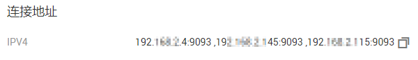
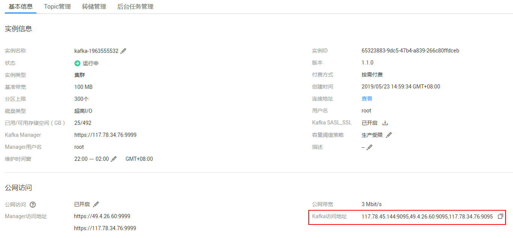

# 连接已开启SASL的Kafka专享版实例<a name="kafka-ug-180801001"></a>

创建实例时开启SASL\_SSL访问，则数据加密传输，安全性更高。

由于安全问题，2021年3月20日前以及当天创建的实例，支持的加密套件为**TLS\_ECDHE\_ECDSA\_WITH\_AES\_128\_CBC\_SHA256**，**TLS\_ECDHE\_RSA\_WITH\_AES\_128\_CBC\_SHA256**和**TLS\_ECDHE\_RSA\_WITH\_AES\_128\_GCM\_SHA256**。2021年3月20日后创建的实例，支持的加密套件为**TLS\_ECDHE\_RSA\_WITH\_AES\_128\_GCM\_SHA256**。

本节介绍如何使用开源的Kafka客户端访问开启SASL的Kafka专享实例的方法。

> **说明：** 
>-   2020年7月以及之后购买的实例，Kafka服务器允许客户端单IP连接的个数为1000个，在此之前购买的实例，Kafka服务器允许客户端单IP连接的个数为200个，如果超过了，会出现连接失败问题。您可以通过[修改配置参数](修改配置参数.md)来修改单IP的连接数。
>-   使用SASL方式连接Kafka实例时，为了客户端能够快速解析实例的Broker，建议在客户端所在主机的“/etc/hosts”文件中配置host和IP的映射关系。
>    其中，IP地址必须为实例连接地址（Broker地址），host为每个实例主机的名称（您可以自定义主机的名称，但不能重复）。
>    例如：
>    10.154.48.120 server01
>    10.154.48.121 server02
>    10.154.48.122 server03

## 前提条件<a name="zh-cn_topic_0143117217_section17830048113810"></a>

-   已配置正确的安全组。

    访问开启SASL的Kafka专享实例时，支持**VPC内访问**和**公网访问**两种方式，实例需要配置正确的安全组规则，具体安全组配置要求，请参考[表2](准备实例依赖资源.md#table161395381402)。

-   <a name="li10340528173815"></a>已获取连接Kafka专享版实例的地址。
    -   如果是VPC内访问，实例端口为9093，实例连接地址获取如下图。

        **图 1**  获取VPC内访问Kafka专享实例的连接地址（实例已开启SASL）<a name="zh-cn_topic_0143117217_fig14172952131510"></a>  
        

    -   如果是公网访问，实例端口为9095，实例连接地址获取如下图。

        **图 2**  获取公网访问Kafka专享实例的连接地址（实例已开启SASL）<a name="fig9534164071419"></a>  
        


-   Kafka专享实例已创建Topic，否则请提前[创建Topic](创建Topic.md)。
-   已下载client.truststore.jks证书。如果没有，在控制台单击Kafka实例名称，进入实例详情页面，在“基本信息 \> 高级配置 \> Kafka SASL\_SSL”所在行，单击。下载压缩包后解压，获取压缩包中的客户端证书文件：client.truststore.jks。
-   已下载[Kafka命令行工具1.1.0版本](https://archive.apache.org/dist/kafka/1.1.0/kafka_2.11-1.1.0.tgz)或者[Kafka命令行工具2.3.0版本](https://archive.apache.org/dist/kafka/2.3.0/kafka_2.11-2.3.0.tgz)，确保Kafka实例版本与命令行工具版本相同。
-   已在Kafka命令行工具的使用环境中安装[Java Development Kit 1.8.111或以上版本](https://www.oracle.com/java/technologies/downloads/#java8)，并完成环境变量配置。

## 命令行模式连接实例<a name="zh-cn_topic_0143117217_section189213202426"></a>

以下操作命令以Linux系统为例进行说明。

1.  解压Kafka命令行工具。

    进入文件压缩包所在目录，然后执行以下命令解压文件。

    **tar -zxf  _\[kafka\_tar\]_**

    其中，_\[kafka\_tar\]_表示命令行工具的压缩包名称。

    例如：

    **tar -zxf kafka\_2.11-1.1.0.tgz**

2.  修改Kafka命令行工具配置文件。

    在Kafka命令行工具的“/config”目录中找到“consumer.properties”和“producer.properties”文件，并分别在文件中增加如下内容。

    ```
    sasl.jaas.config=org.apache.kafka.common.security.plain.PlainLoginModule required \
    username="**********" \
    password="**********";        
    sasl.mechanism=PLAIN
    
    security.protocol=SASL_SSL
    ssl.truststore.location=/opt/kafka_2.11-1.1.0/config/client.truststore.jks
    ssl.truststore.password=dms@kafka
    ssl.endpoint.identification.algorithm=
    ```

    参数说明：

    -   username和password为创建Kafka专享实例过程中开启SASL\_SSL时填入的用户名和密码，或者创建SASL\_SSL用户时设置的用户名和密码。
    -   ssl.trustore.location配置为client.truststore.jks证书的存放路径。注意，Windows系统下证书路径中也必须使用“/”，不能使用Windows系统中拷贝路径时的“\\”，否则客户端获取证书失败。
    -   **ssl.truststore.password为服务器证书密码，不可更改，需要保持为dms@kafka**。
    -   ssl.endpoint.identification.algorithm为证书域名校验开关，为空则表示关闭。这里需要**保持关闭状态，必须设置为空**。

3.  进入Kafka命令行工具的“/bin”目录下。

    注意，Windows系统下需要进入“/bin/windows”目录下。

4.  执行如下命令进行生产消息。

    ```
    ./kafka-console-producer.sh --broker-list ${连接地址} --topic ${Topic名称} --producer.config ../config/producer.properties
    ```

    参数说明如下：

    -   连接地址：从[前提条件](#li10340528173815)获取的连接地址，如果是公网访问，请使用“Kafka访问地址”，如果是VPC内访问，请使用“连接地址”，请根据实际情况选择。
    -   Topic名称：Kafka实例下创建的Topic名称。

    本文以公网访问为例，Kafka实例连接地址为“10.xxx.xxx.202:9095,10.xxx.xxx.197:9095,10.xxx.xxx.68:9095”。

    执行完命令后，输入需要生产的消息内容，按“Enter”发送消息到Kafka实例，输入的每一行内容都将作为一条消息发送到Kafka实例。

    ```
    [root@ecs-kafka bin]#./kafka-console-producer.sh --broker-list 10.xxx.xxx.202:9095,10.xxx.xxx.197:9095,10.xxx.xxx.68:9095  --topic topic-demo --producer.config ../config/producer.properties
    >hello
    >DMS
    >Kafka!
    >^C[root@ecs-kafka bin]# 
    ```

    如需停止生产使用**Ctrl+C**命令退出。

5.  执行如下命令消费消息。

    ```
    ./kafka-console-consumer.sh --bootstrap-server ${连接地址} --topic ${Topic名称} --group ${消费组名称} --from-beginning  --consumer.config ../config/consumer.properties
    ```

    参数说明如下：

    -   连接地址：从[前提条件](#li10340528173815)获取的连接地址，如果是公网访问，请使用“Kafka访问地址”，如果是VPC内访问，请使用“连接地址”，请根据实际情况选择。
    -   Topic名称：Kafka实例下创建的Topic名称。
    -   消费组名称：根据您的业务需求，设定消费组名称。

    示例如下：

    ```
    [root@ecs-kafka bin]#  ./kafka-console-consumer.sh --bootstrap-server 10.xxx.xxx.202:9095,10.xxx.xxx.197:9095,10.xxx.xxx.68:9095 --topic topic-demo --group order-test --from-beginning --consumer.config ../config/consumer.properties
    hello
    Kafka!
    DMS
    hello
    ^CProcessed a total of 4 messages
    [root@ecs-kafka bin]# 
    ```

    如需停止消费使用**Ctrl+C**命令退出。


