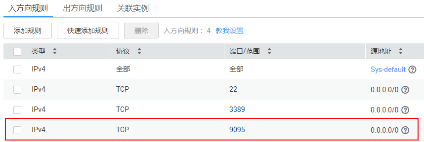

# 连接已开启SASL的Kafka专享版实例<a name="ZH-CN_TOPIC_0171821732"></a>

创建实例时开启SASL\_SSL访问，则数据加密传输，安全性更高。

本节介绍如何使用开源的Kafka客户端访问开启SASL的Kafka专享实例的方法。

> **说明：**   
>使用SASL方式连接Kafka实例时，为了客户端能够快速解析实例的Broker节点，建议配置host和IP的映射关系。  
>其中，IP地址必须为实例连接地址（Broker节点地址），host为每个实例主机的名称，可以自定义，但不能重复。  
>例如：  
>10.154.48.120 server01  
>10.154.48.121 server02  
>10.154.48.122 server03  

## 前提条件<a name="zh-cn_topic_0143117217_section17830048113810"></a>

1.  已配置正确的安全组。

    访问开启SASL的Kafka专享实例时，支持**VPC内访问**和**公网访问**两种方式。

    -   如果是VPC内访问，除了弹性云服务器与Kafka专享版实例的VPC需要保持一致，弹性云服务器和Kafka专享版实例还需要配置了正确的安全组规则，客户端才能正常访问Kafka实例。安全组配置要求，请参考[如何选择和配置安全组](https://support.huaweicloud.com/kafka_faq/kafka-faq-180604024.html)。
    -   如果是公网访问，不需要关注弹性云服务器和Kafka实例的VPC是否一致，只需要保证Kafka实例所在的安全组配置为正确的规则，客户端才能访问Kafka实例。

        SASL开启时，需要放开入方向的**9095**端口。

        **图 1**  Kafka实例安全组规则（实例已开启SASL）<a name="zh-cn_topic_0143117217_fig172421742194720"></a>  
        

2.  <a name="zh-cn_topic_0143117217_li1422895833615"></a>已获取连接Kafka专享版实例的地址。
    -   如果是VPC内访问，获取实例详情中的“连接地址”。

        **图 2**  获取VPC内访问Kafka专享实例的连接地址（实例已开启SASL）<a name="zh-cn_topic_0143117217_fig14172952131510"></a>  
        

    -   如果是公网访问，获取实例详情中的“Kafka访问地址”。

        **图 3**  获取公网访问Kafka专享实例的连接地址（实例已开启SASL）<a name="zh-cn_topic_0143117217_zh-cn_topic_0169795201_fig1723713417247"></a>  
        

3.  Kafka专享实例已创建Topic。

## 命令行模式连接实例<a name="zh-cn_topic_0143117217_section189213202426"></a>

1.  下载client.truststore.jks证书。

    下载地址：[https://dms-demo.obs.myhwclouds.com/cert.zip](https://dms-demo.obs.myhwclouds.com/cert.zip)，下载压缩包后解压，获取压缩包中的客户端证书文件：client.truststore.jks。

2.  登录Linux系统的弹性云服务器。
3.  安装Java JDK或JRE，并配置JAVA\_HOME与PATH环境变量，使用执行用户在用户家目录下修改.bash\_profile，添加如下行。

    ```
    export JAVA_HOME=/opt/java/jdk1.8.0_151 
    export PATH=$JAVA_HOME/bin:$PATH
    ```

    执行source .bash\_profile命令使修改生效。

    > **说明：**   
    >ECS虚拟机默认自带的JDK可能不符合要求，例如OpenJDK，需要配置为Oracle的JDK，可至[Oracle官方下载页面](http://www.oracle.com/technetwork/java/javase/downloads/index.html)下载Java Development Kit 1.8.111及以上版本。  

4.  下载开源的Kafka客户端。1.1.0版本实例的下载地址：[https://archive.apache.org/dist/kafka/1.1.0/kafka\_2.11-1.1.0.tgz](https://archive.apache.org/dist/kafka/1.1.0/kafka_2.11-1.1.0.tgz)

    **wget https://archive.apache.org/dist/kafka/1.1.0/kafka\_2.11-1.1.0.tgz**

5.  解压Kafka客户端文件，下面以1.1.0版本为例。

    **tar -zxf  _\[kafka\_tar\]_**

    其中，_\[kafka\_tar\]_表示客户端的压缩包名称。

    例如：

    **tar -zxf kafka\_2.11-1.1.0.tgz**

6.  在consumer.properties和producer.properties文件中增加如下行：

    ```
    sasl.jaas.config=org.apache.kafka.common.security.plain.PlainLoginModule required \
    username="**********" \
    password="**********";        
    sasl.mechanism=PLAIN
    
    security.protocol=SASL_SSL
    ssl.truststore.location=/opt/kafka_2.11-1.1.0/config/client.truststore.jks
    ssl.truststore.password=dms@kafka
    ```

    说明：其中username和password为创建Kafka专享实例时开启SASL\_SSL时填入的用户名和密码， ssl.trustore.location配置为证书的存放路径。

7.  进入“\[base\_dir\]/kafka\_2.11-1.1.0/bin”目录下。
8.  执行如下命令进行生产消息。

    **./kafka-console-producer.sh --broker-list \[连接地址\] --topic \[Topic名称\] --producer.config ../config/producer.properties**

    参数说明如下：

    -   **_\[连接地址\]_**为[2](#zh-cn_topic_0143117217_li1422895833615)获取的连接地址，如果是公网访问，请使用“Kafka访问地址”，如果是VPC内访问，请使用“连接地址”，请根据实际情况选择。
    -   **_\[Topic名称\]_**表示Kafka实例下创建的Topic名称。

    本文以公网访问为例，Kafka实例连接地址为“10.xxx.xxx.202:9095,10.xxx.xxx.197:9095,10.xxx.xxx.68:9095”。

    执行完命令后输入内容，按回车键发送消息到Kafka实例，输入的每一行内容都将作为一条消息发送到Kafka实例。

    ```
    [root@ecs-heru bin]#./kafka-console-producer.sh --broker-list 10.xxx.xxx.202:9095,10.xxx.xxx.197:9095,10.xxx.xxx.68:9095  --topic topic-heru --producer.config ../config/producer.properties
    >hello
    >DMS
    >Kafka!
    >^C[root@ecs-heru bin]# 
    ```

    如需停止生产使用**Ctrl+C**命令退出。

9.  执行如下命令消费消息。

    **./kafka-console-consumer.sh --bootstrap-server \[连接地址\] --topic \[Topic名称\] --from-beginning  --consumer.config ../config/consumer.properties**

    ```
    [root@ecs-heru bin]#  ./kafka-console-consumer.sh --bootstrap-server 10.xxx.xxx.202:9095,10.xxx.xxx.197:9095,10.xxx.xxx.68:9095 --topic topic-heru --from-beginning --consumer.config ../config/consumer.properties
    hello
    Kafka!
    abcd
    DMS
    heuu
    hello
    ^CProcessed a total of 6 messages
    [root@ecs-heru bin]# 
    ```

    如需停止消费使用**Ctrl+C**命令退出。


