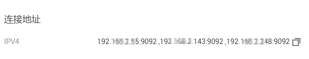

# 连接未开启SASL的Kafka专享实例<a name="ZH-CN_TOPIC_0171821731"></a>

目前，华为云提供Kafka专享版实例的服务，Kafka专享版实例采用物理隔离的方式部署，租户独占Kafka实例。创建Kafka专享版实例之后，使用开源Kafka客户端向Kafka专享版实例生产消息和消费消息。

本节介绍如何使用开源的Kafka客户端访问未开启SASL的Kafka专享实例的方法。

多语言客户端的使用请参考Kafka官网：[https://cwiki.apache.org/confluence/display/KAFKA/Clients](https://cwiki.apache.org/confluence/display/KAFKA/Clients)

> **说明：**   
>-   本章节主要描述使用命令行模式连接Kafka实例，如果是在业务代码中连接Kafka实例，请参考《[Kakfa专享实例开发指南](https://support.huaweicloud.com/devg-kafka/Kafka-summary.html)》。  
>-   Kafka服务器允许客户端单IP连接的个数为200个，如果超过了，会出现连接失败问题。  

## 前提条件<a name="zh-cn_topic_0143117094_section17830048113810"></a>

1.  已配置正确的安全组。

    访问未开启SASL的Kafka专享实例时，支持**VPC内访问**和**公网访问**两种方式。

    -   如果是VPC内访问，除了弹性云服务器与Kafka专享版实例的VPC需要保持一致，弹性云服务器和Kafka专享版实例还需要配置了正确的安全组规则，客户端才能正常访问Kafka实例。安全组配置要求，请参考[如何选择和配置安全组](https://support.huaweicloud.com/kafka_faq/kafka-faq-180604024.html)。
    -   如果是公网访问，不需要关注弹性云服务器和Kafka实例的VPC，只需要保证Kafka实例所在的安全组配置为正确的规则，客户端才能访问Kafka实例。

        SASL关闭时，需要放开入方向的**9094**端口。

        **图 1**  Kafka实例安全组规则（实例未开启SASL）<a name="zh-cn_topic_0143117094_fig172421742194720"></a>  
        

2.  <a name="zh-cn_topic_0143117094_li1422895833615"></a>已获取连接Kafka专享版实例的地址。

    -   如果是VPC内访问，实例端口为9092，实例连接地址获取如下图。

        **图 2**  获取VPC内访问Kafka专享实例的连接地址（实例未开启SASL）<a name="fig1688245415313"></a>  
        

    -   如果是公网访问，实例端口为9094，实例连接地址获取如下图。

        **图 3**  获取公网访问Kafka专享实例的连接地址（实例未开启SASL）<a name="fig11883115485319"></a>  
        

3.  Kafka专享实例已创建Topic。
4.  弹性云服务器的环境已配置正确，并已下载Kafka开源客户端。如果没有，请执行以下操作。
    1.  登录弹性云服务器。

        本文以Linux系统的弹性云服务器为例。Windows系统弹性云服务器的JDK安装与环境变量配置可自行在互联网查找相关帮助。

    2.  安装Java JDK或JRE，并配置JAVA\_HOME与PATH环境变量，使用执行用户在用户家目录下修改.bash\_profile，添加如下行。

        ```
        export JAVA_HOME=/opt/java/jdk1.8.0_151 
        export PATH=$JAVA_HOME/bin:$PATH
        ```

        执行source .bash\_profile命令使修改生效。

        > **说明：**   
        >ECS虚拟机默认自带的JDK可能不符合要求，例如OpenJDK，需要配置为Oracle的JDK，可至[Oracle官方下载页面](https://www.oracle.com/technetwork/java/javase/downloads/index.html)下载Java Development Kit 1.8.111及以上版本。  

    3.  下载开源的Kafka客户端。对应1.1.0版本实例的下载地址：[https://archive.apache.org/dist/kafka/1.1.0/kafka\_2.11-1.1.0.tgz](https://archive.apache.org/dist/kafka/1.1.0/kafka_2.11-1.1.0.tgz)

        **wget https://archive.apache.org/dist/kafka/1.1.0/kafka\_2.11-1.1.0.tgz**

    4.  解压Kafka客户端文件。

        **tar -zxf  _\[kafka\_tar\]_**

        其中，_\[kafka\_tar\]_表示客户端的压缩包名称。

        例如：

        **tar -zxf kafka\_2.11-1.1.0.tgz**


## 命令行模式连接实例<a name="zh-cn_topic_0143117094_section189213202426"></a>

1.  登录Linux系统的弹性云服务器。
2.  执行如下命令进行生产消息。

    **_./kafka-console-producer.sh --broker-list \[连接地址\] --topic \[Topic名称\]_**

    参数说明如下：

    -   **_\[连接地址\]_**为[2](#zh-cn_topic_0143117094_li1422895833615)中获取的连接地址，如果是公网访问，请使用“Kafka访问地址”，如果是VPC内访问，请使用“连接地址”，请根据实际情况选择。
    -   **_\[Topic名称\]_**表示Kafka实例下创建的Topic名称。

    本文以公网连接为例，获取的Kafka实例公网连接地址为“10.3.196.45:9094,10.78.42.127:9094,10.4.49.103:9094”。执行完命令后输入内容，按回车键发送消息到Kafka实例，输入的每一行内容都将作为一条消息发送到Kafka实例。

    ```
    [root@ecs-heru bin]# ./kafka-console-producer.sh --broker-list 10.3.196.45:9094,10.78.42.127:9094,10.4.49.103:9094  --topic topic-heru
    >Hello
    >DMS
    >Kafka!
    >^C[root@ecs-heru bin]# 
    ```

    如需停止生产使用**Ctrl+C**命令退出。

3.  执行如下命令消费消息。

    _**./kafka-console-consumer.sh --bootstrap-server \[连接地址\] --topic \[Topic名称\] --from-beginning**_

    ```
    [root@ecs-heru bin]#  ./kafka-console-consumer.sh --bootstrap-server 10.3.196.45:9094,10.78.42.127:9094,10.4.49.103:9094 --topic topic-heru --from-beginning
    Kafka!
    DMS
    Hello
    ^CProcessed a total of 3 messages
    [root@ecs-heru bin]# 
    ```

    如需停止消费使用**Ctrl+C**命令退出。


