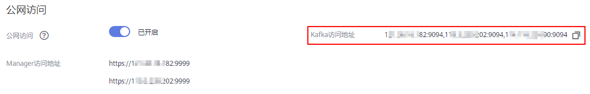

# 连接未开启SASL的Kafka专享版实例<a name="kafka-ug-180604020"></a>

目前，华为云提供Kafka专享版实例的服务，Kafka专享版实例采用物理隔离的方式部署，租户独占Kafka实例。创建Kafka专享版实例之后，使用开源Kafka客户端向Kafka专享版实例生产消息和消费消息。

本章节介绍如何使用开源的Kafka客户端访问未开启SASL的Kafka专享实例的方法。

多语言客户端的使用请参考Kafka官网：[https://cwiki.apache.org/confluence/display/KAFKA/Clients](https://cwiki.apache.org/confluence/display/KAFKA/Clients)

> **说明：** 
>-   本章节主要描述使用命令行模式连接Kafka实例，如果是在业务代码中连接Kafka实例，请参考《[Kafka专享实例开发指南](https://support.huaweicloud.com/devg-kafka/Kafka-summary.html)》。
>-   2020年7月以及之后购买的实例，Kafka服务器允许客户端单IP连接的个数为1000个，在此之前购买的实例，Kafka服务器允许客户端单IP连接的个数为200个，如果超过了，会出现连接失败问题。您可以通过[修改配置参数](修改配置参数.md)来修改单IP的连接数。

## 前提条件<a name="zh-cn_topic_0143117094_section17830048113810"></a>

-   已配置正确的安全组。

    访问未开启SASL的Kafka专享实例时，支持**VPC内访问**和**公网访问**两种方式，实例需要配置正确的安全组规则，具体安全组配置要求，请参考[表2](准备实例依赖资源.md#table161395381402)。

-   <a name="li139061643115913"></a>已获取连接Kafka专享版实例的地址。
    -   如果是VPC内访问，实例端口为9092，实例连接地址获取如下图。

        **图 1**  获取VPC内访问Kafka专享实例的连接地址（实例未开启SASL）<a name="fig1688245415313"></a>  
        

    -   如果是公网访问，实例端口为9094，实例连接地址获取如下图。

        **图 2**  获取公网访问Kafka专享实例的连接地址（实例未开启SASL）<a name="fig37231134174010"></a>  
        


-   Kafka专享实例已创建Topic，否则请提前[创建Topic](创建Topic.md)。
-   已下载[Kafka命令行工具1.1.0版本](https://archive.apache.org/dist/kafka/1.1.0/kafka_2.11-1.1.0.tgz)或者[Kafka命令行工具2.3.0版本](https://archive.apache.org/dist/kafka/2.3.0/kafka_2.11-2.3.0.tgz)，确保Kafka实例版本与命令行工具版本相同。
-   已在Kafka命令行工具的使用环境中安装[Java Development Kit 1.8.111或以上版本](https://www.oracle.com/java/technologies/downloads/#java8)，并完成环境变量配置。

## 命令行模式连接实例<a name="zh-cn_topic_0143117094_section189213202426"></a>

以下操作命令以Linux系统为例进行说明：

1.  解压Kafka命令行工具。

    进入文件压缩包所在目录，然后执行以下命令解压文件。

    **tar -zxf  _\[kafka\_tar\]_**

    其中，_\[kafka\_tar\]_表示命令行工具的压缩包名称。

    例如：

    **tar -zxf kafka\_2.11-1.1.0.tgz**

2.  进入Kafka命令行工具的“/bin”目录下。

    注意，Windows系统下需要进入“/bin/windows”目录下。

3.  执行如下命令进行生产消息。

    ```
    ./kafka-console-producer.sh --broker-list ${连接地址} --topic ${Topic名称}
    ```

    参数说明如下：

    -   连接地址：从[前提条件](#li139061643115913)中获取的连接地址，如果是公网访问，请使用“Kafka访问地址”，如果是VPC内访问，请使用“连接地址”，请根据实际情况选择。
    -   Topic名称：Kafka实例下创建的Topic名称。

    本文以公网连接为例，获取的Kafka实例公网连接地址为“10.3.196.45:9094,10.78.42.127:9094,10.4.49.103:9094”。执行完命令后输入内容，按“Enter”发送消息到Kafka实例，输入的每一行内容都将作为一条消息发送到Kafka实例。

    ```
    [root@ecs-kafka bin]# ./kafka-console-producer.sh --broker-list 10.3.196.45:9094,10.78.42.127:9094,10.4.49.103:9094  --topic topic-demo
    >Hello
    >DMS
    >Kafka!
    >^C[root@ecs-kafka bin]# 
    ```

    如需停止生产使用**Ctrl+C**命令退出。

4.  执行如下命令消费消息。

    ```
    ./kafka-console-consumer.sh --bootstrap-server ${连接地址} --topic ${Topic名称} --group ${消费组名称} --from-beginning
    ```

    参数说明如下：

    -   连接地址：从[前提条件](#li139061643115913)中获取的连接地址，如果是公网访问，请使用“Kafka访问地址”，如果是VPC内访问，请使用“连接地址”，请根据实际情况选择。
    -   Topic名称：Kafka实例下创建的Topic名称。
    -   消费组名称：根据您的业务需求，设定消费组名称。

    示例如下：

    ```
    [root@ecs-kafka bin]#  ./kafka-console-consumer.sh --bootstrap-server 10.3.196.45:9094,10.78.42.127:9094,10.4.49.103:9094 --topic topic-demo --group order-test --from-beginning
    Kafka!
    DMS
    Hello
    ^CProcessed a total of 3 messages
    [root@ecs-kafka bin]# 
    ```

    如需停止消费使用**Ctrl+C**命令退出。


