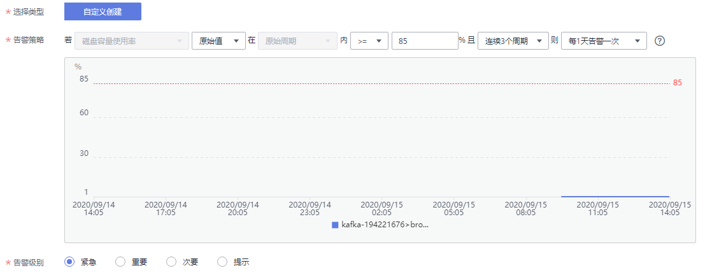

# 配置告警

本章节主要介绍部分监控指标的告警策略，以及配置操作。在实际业务中，建议按照以下告警策略，配置监控指标的告警规则。

> **说明：**   
>**是否接近性能上限**，表示当前资源支撑的性能为告警策略中设置的告警阈值，如果继续上升，业务可能出现问题。  

**表 1**  Kafka实例配置告警的指标

<table><thead align="left"><tr id="row133010254169"><th class="cellrowborder" valign="top" width="13.601360136013602%" id="mcps1.2.6.1.1">
指标名称

</th>
<th class="cellrowborder" valign="top" width="15.081508150815083%" id="mcps1.2.6.1.2">
正常范围

</th>
<th class="cellrowborder" valign="top" width="16.09160916091609%" id="mcps1.2.6.1.3">
告警策略

</th>
<th class="cellrowborder" valign="top" width="14.391439143914392%" id="mcps1.2.6.1.4">
是否接近性能上限

</th>
<th class="cellrowborder" valign="top" width="40.83408340834083%" id="mcps1.2.6.1.5">
指标说明

</th>
</tr>
</thead>
<tbody><tr id="row33301251166"><td class="cellrowborder" valign="top" width="13.601360136013602%" headers="mcps1.2.6.1.1 ">
内存使用率

</td>
<td class="cellrowborder" valign="top" width="15.081508150815083%" headers="mcps1.2.6.1.2 ">
0~100

</td>
<td class="cellrowborder" valign="top" width="16.09160916091609%" headers="mcps1.2.6.1.3 ">
告警阈值：原始值&gt;85

连续触发次数：3

告警级别：紧急

</td>
<td class="cellrowborder" valign="top" width="14.391439143914392%" headers="mcps1.2.6.1.4 ">
是

</td>
<td class="cellrowborder" valign="top" width="40.83408340834083%" headers="mcps1.2.6.1.5 ">
该指标为Kafka节点虚拟机层面采集的内存使用率。

单位：%。

</td>
</tr>
<tr id="row11612547193318"><td class="cellrowborder" valign="top" width="13.601360136013602%" headers="mcps1.2.6.1.1 ">
磁盘容量使用率

</td>
<td class="cellrowborder" valign="top" width="15.081508150815083%" headers="mcps1.2.6.1.2 ">
0~100

</td>
<td class="cellrowborder" valign="top" width="16.09160916091609%" headers="mcps1.2.6.1.3 ">
告警阈值：原始值&gt;85

连续触发次数：3

告警级别：紧急

</td>
<td class="cellrowborder" valign="top" width="14.391439143914392%" headers="mcps1.2.6.1.4 ">
是

</td>
<td class="cellrowborder" valign="top" width="40.83408340834083%" headers="mcps1.2.6.1.5 ">
该指标为从Kafka节点虚拟机层面采集的磁盘容量使用率。

单位：%。

</td>
</tr>
<tr id="row23318255167"><td class="cellrowborder" valign="top" width="13.601360136013602%" headers="mcps1.2.6.1.1 ">
CPU核均负载

</td>
<td class="cellrowborder" valign="top" width="15.081508150815083%" headers="mcps1.2.6.1.2 ">
0~2

</td>
<td class="cellrowborder" valign="top" width="16.09160916091609%" headers="mcps1.2.6.1.3 ">
告警阈值：原始值&gt;1.5

连续触发次数：3

告警级别：重要

</td>
<td class="cellrowborder" valign="top" width="14.391439143914392%" headers="mcps1.2.6.1.4 ">
是

</td>
<td class="cellrowborder" valign="top" width="40.83408340834083%" headers="mcps1.2.6.1.5 ">
该指标为从Kafka节点虚拟机层面采集的CPU每个核的平均负载。

</td>
</tr>
<tr id="row44698103613"><td class="cellrowborder" valign="top" width="13.601360136013602%" headers="mcps1.2.6.1.1 ">
Kafka进程JVM堆内存使用率

</td>
<td class="cellrowborder" valign="top" width="15.081508150815083%" headers="mcps1.2.6.1.2 ">
0~100

</td>
<td class="cellrowborder" valign="top" width="16.09160916091609%" headers="mcps1.2.6.1.3 ">
告警阈值：原始值&gt;85

连续触发次数：3

告警级别：紧急

</td>
<td class="cellrowborder" valign="top" width="14.391439143914392%" headers="mcps1.2.6.1.4 ">
是

</td>
<td class="cellrowborder" valign="top" width="40.83408340834083%" headers="mcps1.2.6.1.5 ">
该指标从Kafka节点Kafka进程JVM中采集的堆内存使用率。

单位：%。

</td>
</tr>
</tbody>
</table>

## 操作步骤

1.  登录管理控制台。
2.  在管理控制台左上角单击，选择区域。

    > **说明：**   
    >此处请选择与您的应用服务相同的区域。  

3.  单击页面上方的“服务列表”，选择“应用服务 \> 分布式消息服务 Kafka”，进入分布式消息服务Kafka页面。
4.  单击实例名称后的“更多 \> 查看监控数据”。

    进入云监控该实例的监控指标页面。

5.  在实例监控指标页面中，找到需要创建告警的指标项，鼠标移动到指标区域，然后单击指标右上角的，创建告警规则。

    跳转到创建告警规则页面。

6.  在告警规则页面，设置告警信息。

    创建告警规则操作，请查看云监控服务的用户指南“[创建告警规则](https://support.huaweicloud.com/usermanual-ces/zh-cn_topic_0084572213.html)”。

    1.  设置告警策略和告警级别。

        如下图所示，在进行指标监控时，如果连续3个周期，内存利用率原始值超过设置的值，则产生告警，如果未及时处理，则每一天发送一次告警通知。

        **图 1**  设置告警策略和告警级别  
        

    2.  设置“告警通知”开关。当开启时，设置告警生效时间、产生告警时通知的对象以及触发的条件。
    3.  单击“下一步”，设置告警名称和告警的描述。
    4.  单击“创建”，等待创建告警规则成功。

