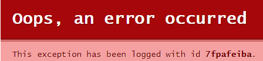

# 重启Kafka Manager

## 操作场景

当Kafka Manager无法登录或者无法使用时，例如下图中的报错，可以通过重启Kafka Manager，使Kafka Manager恢复正常。

**图 1**  报错信息  

> **说明：** 
>重启Kafka Manager不会影响业务。

## 操作步骤

1.  登录管理控制台。
2.  在管理控制台左上角单击，选择区域。

    > **说明：** 
    >此处请选择与您的应用服务相同的区域。

3.  在管理控制台左上角单击，选择“应用中间件 \> 分布式消息服务Kafka版”，进入分布式消息服务Kafka专享版页面。
4.  在需要重启Manager的Kafka专享实例右侧，单击“更多 \> 重启Manager”，弹出“重启kafka-Manager”对话框。
5.  单击“确定”。

    您可以在实例的“后台任务管理”页面，查看当前任务的操作进度。任务状态为“成功”，表示重启成功。

