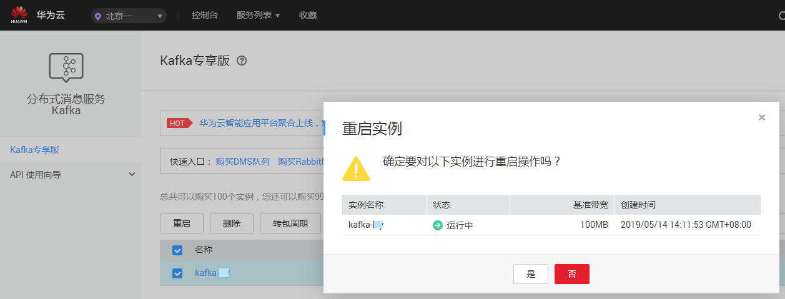

# 重启实例

## 操作场景

分布式消息服务管理控制台支持重启运行中的Kafka专享版实例，且可实现批量重启Kafka专享版实例。

> **警告：**   
>在Kafka专享版实例重启过程中，客户端的生产与消费消息等请求会被拒绝。  

## 前提条件

只有当Kafka专享版实例处于“运行中”或“故障”状态，才能执行重启操作。

## 操作步骤

1.  登录管理控制台。
2.  在管理控制台左上角单击，选择区域。

    > **说明：**   
    >此处请选择与您的应用服务相同的区域。  

3.  单击页面上方的“服务列表”，选择“应用服务 \> 分布式消息服务 Kafka”，进入分布式消息服务Kafka专享版页面。
4.  勾选“名称”栏下的相应Kafka专享版实例名称左侧的方框，可选一个或多个。
5.  单击信息栏左上侧的“重启”。
6.  单击“是”，完成重启Kafka专享版实例。

    重启Kafka专享版实例大约需要1到30分钟。Kafka专享版实例重启成功后，Kafka专享版实例状态切换为“运行中”。

    > **说明：**   
    >重启Kafka专享版实例只会重启实例进程，不会重启实例所在虚拟机。  
    >如果只需要重启单个Kafka专享版实例，也可以在“Kafka专享版”界面，单击指定Kafka专享版实例右侧“操作”栏下的“重启”。  

    **图 1**  重启Kafka专享版实例  
    

